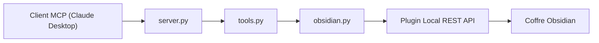

# MarkusPfundstein/mcp-obsidian

> Serveur MCP qui laisse un assistant lire, chercher et modifier un coffre Obsidian.

## Le problème
Faire travailler un assistant sur tes notes Obsidian sans copier-coller.

## Ce que ça fait vraiment
Le serveur passe par le plugin communautaire « Local REST API » d'Obsidian et expose sept outils : lister fichiers et dossiers, lire un fichier, chercher, insérer dans une note (titre, bloc, frontmatter), ajouter du contenu et supprimer. Configuration par variables `OBSIDIAN_API_KEY`, `OBSIDIAN_HOST`, `OBSIDIAN_PORT`. Version du SDK `mcp` à rester en 1.x.

## Comment c'est branché


## Essayer
```bash
# Configuration Claude Desktop (extrait du README) :
#   "command": "uvx", "args": ["mcp-obsidian"],
#   "env": {"OBSIDIAN_API_KEY": "<clé>", "OBSIDIAN_HOST": "<hôte>", "OBSIDIAN_PORT": "<port>"}
docker compose build
docker compose run --rm -T mcp-obsidian
```

## Coût et pièges
Gratuit ; nécessite le plugin REST API actif et sa clé. Le README précise `mcp` ≥ 1.1.0 et < 2.0.0 : avec `mcp` 2.0, le serveur plante à l'import.

## Ce que ce n'est pas
Pas un plugin Obsidian : c'est un pont externe. L'outil `delete_file` peut supprimer des notes.

## Alternatives
- obsidian-local-rest-api : le plugin sur lequel il s'appuie, si tu veux appeler l'API directement.

## Pour toi
À adopter : petit, simple à installer et directement utile pour brancher tes notes à un assistant ; garde des sauvegardes du coffre à cause de la suppression.
