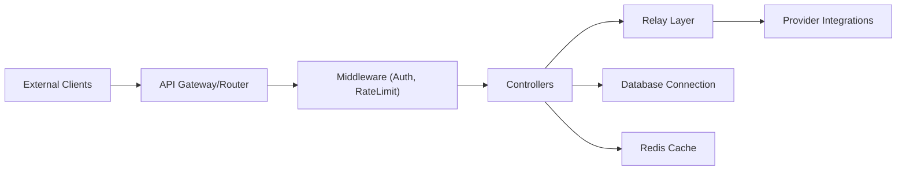

# MartialBE/one-hub

> Passerelle auto-hébergée qui unifie l'accès à de nombreux fournisseurs de LLM, avec facturation et tableaux de bord.

## Le problème
Chaque fournisseur de modèles a son API, ses clés et sa facturation. Sans point d'entrée commun, difficile de distribuer l'accès à une équipe ou de suivre la consommation.

## Ce que ça fait vraiment
Fork de one-api, incompatible en base avec l'original. Un backend Go (Gin) relaie les requêtes vers OpenAI, Azure, Anthropic, Gemini, Mistral, Groq, Ollama et des fournisseurs chinois. Il ajoute tableau de bord utilisateur, statistiques admin, prix par modèle, limites RPM par groupe, paiement, bot Telegram, métriques Prometheus. Le front est en React.

## Comment c'est branché

## Essayer
Le README ne documente aucune commande d'installation ; renvoie à un site de documentation et à `config.example.yaml` (mentionné par l'architecture). Aucune commande n'est donnée ici.

## Coût et pièges
Tu paies les fournisseurs en amont avec tes propres clés. Le README avertit : usage personnel, aucune stabilité ni support garantis, et respect des conditions d'OpenAI. Il déconseille de mélanger avec one-api d'origine (bases incompatibles).

## Ce que ce n'est pas
Pas un produit supporté : l'auteur le dit lui-même. La liste de modèles embarquée n'est plus mise à jour, il faut actualiser les prix à la main dans l'admin. README essentiellement en chinois.

## Alternatives
- one-api : le projet d'origine, dont celui-ci est un fork.
- new api : source du code Midjourney/Suno repris ici.

## Pour toi
À surveiller : utile si tu dois redistribuer des clés LLM à une équipe, mais sans support et fork d'un projet tiers, à n'installer qu'en connaissance de cause.
