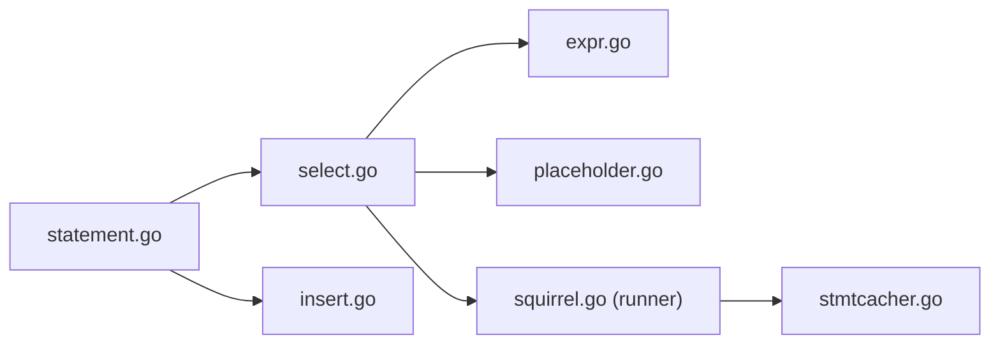

# Masterminds/squirrel

> Générateur de requêtes SQL fluide pour Go, qui n'est pas un ORM.

## Le problème
Construire des requêtes SQL dynamiques par concaténation de chaînes est fragile en Go.

## Ce que ça fait vraiment
Builders SELECT, INSERT, UPDATE, DELETE et CASE composables, avec arguments liés, format de paramètres (`Dollar` pour PostgreSQL) et exécution via un runner (`RunWith`). Cache de requêtes préparées (`StmtCache`) et variantes avec contexte.

## Comment c'est branché


## Essayer
```go
users := sq.Select("*").From("users").Join("emails USING (email_id)")
sql, args, err := users.Where(sq.Eq{"deleted_at": nil}).ToSql()
```

## Coût et pièges
Gratuit. Le projet se dit « complete » : correctifs rares, issues sans réponse garantie (dernier push avril 2024). Licence non identifiée par GitHub.

## Ce que ce n'est pas
Pas un ORM. Pas de tuples dans `IN` (contournement via `Or`/`Eq`).

## Alternatives
- structable : mappeur table-struct bâti sur squirrel.

## Pour toi
À ignorer : peu actif et licence à clarifier ; peu d'intérêt hors services Go avec SQL.

