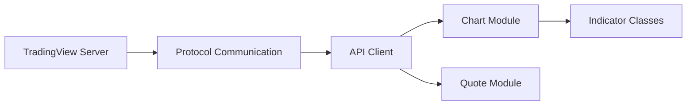

# Mathieu2301/TradingView-API

> Client Node.js non officiel pour récupérer prix en temps réel et valeurs d'indicateurs de TradingView.

## Le problème
TradingView n'offre pas d'API publique simple pour lire cours et indicateurs depuis du code.

## Ce que ça fait vraiment
Bibliothèque JavaScript qui parle aux serveurs TradingView : sessions de graphique et de cotation, indicateurs intégrés et Pine, indicateurs sur invitation, dessins, analyse technique, mode replay (y compris un faux replay pour le plan gratuit), rétrotests de stratégies.

## Comment c'est branché


## Essayer
```bash
npm i @mathieuc/tradingview
```

## Coût et pièges
Aucune licence déclarée : droits d'usage incertains. Le service accédé est un SaaS tiers dont les conditions peuvent interdire ce type d'accès, non abordé par le README. Un sondage indique environ 100 issues ouvertes.

## Ce que ce n'est pas
Pas une API officielle : elle peut casser si TradingView change son protocole. Le README mélange aussi des offres d'assistance personnalisée.

## Alternatives
Le README ne nomme aucune alternative.

## Pour toi
À ignorer : absence de licence et dépendance à un protocole non officiel rendent ce client risqué pour un usage sérieux.
