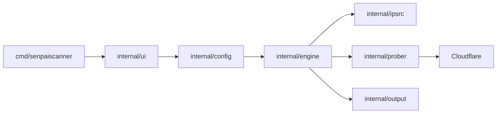

# MatinSenPai/SenPaiScanner

> Scanner d'adresses Cloudflare qui teste latence et débit depuis ton réseau, pour utilisateurs de réseaux filtrés ou instables.

## Le problème
Sur un réseau filtré ou lent, toutes les adresses Cloudflare ne se valent pas ; trouver celles qui répondent vite et fonctionnent avec sa configuration de proxy se fait à la main.

## Ce que ça fait vraiment
- Échantillonne des plages IPv4 Cloudflare embarquées (ou lit un fichier `ips.txt`), sonde chaque adresse sur un ou plusieurs ports et mesure santé, latence, perte, débit.
- Peut valider les meilleurs candidats via un cœur Xray embarqué, à partir de liens `vless://`, `trojan://` ou `vmess://`.
- Exporte adresses brutes, liens réécrits, abonnement Base64, JSON Sing-box ou YAML Clash.
- Trois interfaces : GUI Wails, application Android, CLI/TUI.

## Comment c'est branché


## Essayer
```bash
chmod +x SenPaiScanner-1.0.0-cli-*
./SenPaiScanner-1.0.0-cli-linux-amd64
senpaiscanner --version
```

## Coût et pièges
Gratuit. Les liens de proxy contiennent souvent des identifiants : ne pas les poster dans les issues ou captures. Le README demande de ne scanner que des réseaux et plages que l'on est autorisé à tester.

## Ce que ce n'est pas
Ce n'est pas un scanner de vulnérabilités ni un proxy : il classe des adresses. Anomalie de source : l'architecture d'après le code ne décrit qu'un TUI (Quick/Custom Scan, Test IPs, Discover Colos), alors que le README annonce GUI et Android ; ce qui est effectivement livré n'est pas vérifié.

## Alternatives
Aucune alternative nommée dans le README.

## Pour toi
Ignorer : sans rapport avec un travail data/IA/MLOps, et projet jeune (créé en mai 2026) porté par une seule personne.

