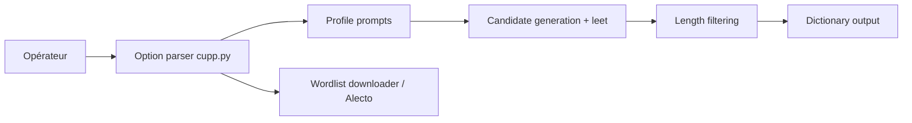

# Mebus/cupp

> Script Python qui génère des listes de mots de passe à partir du profil d'une personne, pour tests autorisés.

## Le problème
Évaluer la robustesse de mots de passe devinables (dates, prénoms, animaux) lors d'un test d'intrusion légal ou d'une enquête.

## Ce que ça fait vraiment
`cupp.py` pose des questions interactives sur la cible, combine et transforme les mots (conversion leet, filtrage de longueur) et écrit un dictionnaire. D'autres options améliorent un dictionnaire existant, téléchargent de grandes listes ou analysent la base Alecto de mots de passe par défaut. Configuration dans `cupp.cfg`.

## Comment c'est branché


## Essayer
```bash
python3 cupp.py -h
python3 cupp.py -i
```

## Coût et pièges
Gratuit, Python 3. Les listes téléchargées viennent de sources distantes. Le README insiste sur un cadre légal (tests autorisés, enquêtes) ; toute autre utilisation relève de la seule responsabilité de l'utilisateur.

## Ce que ce n'est pas
Pas un outil d'audit de mots de passe stockés ni de chiffrement. Projet ancien importé de remote-exploit ; dernier push le 2026-07-17.

## Alternatives
Aucune alternative nommée ; WyD.pl et la base Alecto sont des entrées possibles, pas des concurrents.

## Pour toi
À ignorer : cas d'usage offensif sans lien avec un travail data/IA/MLOps ; à ne garder que pour des tests autorisés en sécurité.
