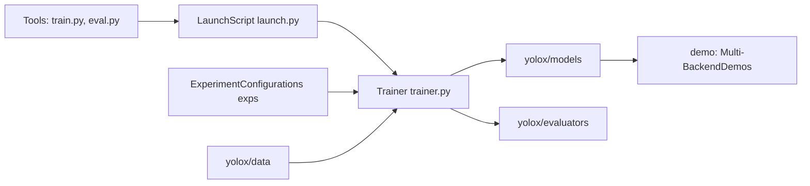

# Megvii-BaseDetection/YOLOX

> Implémentation PyTorch de YOLOX, détecteur d'objets anchor-free, avec entraînement et export multi-backend.

## Le problème
Entraîner et déployer un détecteur temps réel demande un code d'entraînement reproductible et des exports vers plusieurs moteurs d'inférence.

## Ce que ça fait vraiment
Modèles Nano à X (25,8 à 51,5 mAP COCO), poids pré-entraînés, configs d'expériences dans `exps/`.
Scripts de démo image/vidéo, entraînement multi-GPU/multi-nœuds, évaluation batch, journalisation W&B.
Démos de déploiement : ONNX/ONNXRuntime, TensorRT, OpenVINO, ncnn, MegEngine.
Tutoriels pour données custom, cache, gel de modèle.

## Comment c'est branché


## Essayer
```bash
git clone git@github.com:Megvii-BaseDetection/YOLOX.git
cd YOLOX
pip3 install -v -e .
python tools/demo.py image -n yolox-s -c /path/to/your/yolox_s.pth --path assets/dog.jpg --conf 0.25 --nms 0.45 --tsize 640 --save_result --device [cpu/gpu]
python -m yolox.tools.train -n yolox-s -d 8 -b 64 --fp16 -o [--cache]
```

## Coût et pièges
Gratuit, Apache-2.0 ; GPU pour l'entraînement. Dernier push juin 2025, 808 issues ouvertes : peu de maintenance.

## Ce que ce n'est pas
Pas l'état de l'art actuel de la détection ; référence de 2021. Pas de support actif des nouvelles versions de PyTorch garanti.

## Alternatives
- StreamYOLO : extension de YOLOX pour la perception en flux.
- YOLOX-ROS / YOLOX-deepstream : si tu cibles robotique ou DeepStream.

## Pour toi
À ignorer pour un nouveau projet : code solide mais peu maintenu ; privilégier des familles YOLO récentes, garder YOLOX comme baseline de comparaison.
