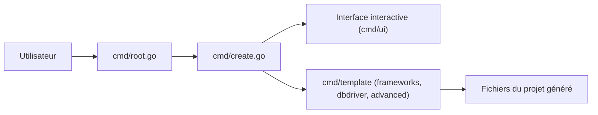

# Melkeydev/go-blueprint

> Générateur en ligne de commande de squelettes de projets Go avec framework HTTP et base de données au choix.

## Le problème
Démarrer un projet Go oblige à recréer chaque fois l'arborescence, le serveur HTTP et la connexion à la base.

## Ce que ça fait vraiment
La commande `go-blueprint create` propose une interface interactive (ou des options) pour choisir nom, framework (Chi, Gin, Fiber, HttpRouter, Gorilla/mux, Echo), pilote de base (Postgres, MySQL, Mongo, Redis, SQLite, ScyllaDB), options avancées (HTMX, Tailwind, React, CI/CD, Docker) et initialisation git. Rend des modèles `text/template` dans un nouveau dossier.

## Comment c'est branché


## Essayer
```bash
go install github.com/melkeydev/go-blueprint@latest
npm install -g @melkeydev/go-blueprint
brew install go-blueprint
go-blueprint create --name my-project --framework gin --driver postgres --git commit
```

## Coût et pièges
Gratuit. Il faut Go et ajouter `$GOPATH/bin` au PATH. Le projet généré reste à maintenir par toi.

## Ce que ce n'est pas
Pas un framework : il génère du code une fois, sans lien ensuite avec ton projet.

## Alternatives
Aucune alternative nommée dans le README.

## Pour toi
À surveiller : utile pour lancer vite un service Go (API d'inférence, collecteur), mais sans intérêt si tu restes sur Python.

