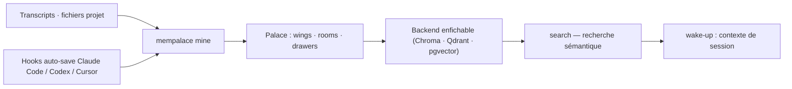

# MemPalace/mempalace

> Mémoire locale pour agents : stockage verbatim des conversations, recherche sémantique, zéro appel API.

## Le problème
Les sessions d'un agent de code expirent ; ce qui a été décidé disparaît. Les couches de mémoire qui résument ou paraphrasent perdent justement le détail qu'on cherchera plus tard.

## Ce que ça fait vraiment
Stocke l'historique en texte verbatim — sans résumé, sans extraction — et le retrouve par recherche sémantique. L'index est structuré : personnes et projets deviennent des *wings*, les sujets des *rooms*, le contenu d'origine vit dans des *drawers*, ce qui permet de restreindre une recherche. Le backend de récupération est enfichable (ChromaDB par défaut ; sqlite_exact, rust_exact, Milvus, Qdrant, pgvector). 45 outils MCP, un graphe de connaissances temporel avec fenêtres de validité, et des hooks d'auto-sauvegarde pour Claude Code, Codex CLI et Cursor.

## Comment c'est branché


## Essayer
```bash
uv tool install mempalace
mempalace init ~/projects/myapp
mempalace mine ~/.claude/projects/ --mode convos
mempalace search "why did we switch to GraphQL"
mempalace wake-up
```

## Coût et pièges
Gratuit, Python 3.9+. ~300 Mo de disque pour le modèle d'embeddings (80 Mo pour minilm). Aucune clé d'API pour le chemin de référence. Attention aux droits de montage Docker sous Linux (uid 1000) et à l'image GPU limitée à x86_64. Le README alerte explicitement sur des **sites imposteurs** : seules sources officielles, ce dépôt, le paquet PyPI et mempalaceofficial.com.

## Ce que ce n'est pas
Ce n'est pas un service cloud : rien ne sort de ta machine sauf opt-in explicite. Termux natif n'est pas supporté (roues Linux uniquement). Le README refuse délibérément toute comparaison chiffrée avec Mem0, Zep ou Supermemory, les métriques n'étant pas comparables.

## Alternatives
- mem0, Mastra, Hindsight, Supermemory, Zep : cités comme projets voisins, sans comparaison chiffrée assumée.

## Pour toi
À adopter : c'est la réponse locale et vérifiable au problème de mémoire d'agent, avec des benchmarks reproductibles depuis le dépôt.
