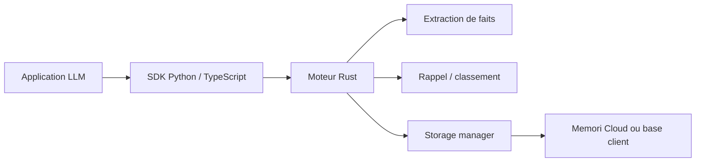

# MemoriLabs/Memori

> SDK de mémoire persistante pour agents LLM, qui capture, structure et rappelle ce que l'agent a fait.

## Le problème
Les agents oublient tout d'une session à l'autre et redécouvrent les mêmes choses en brûlant des jetons.

## Ce que ça fait vraiment
On enregistre un client LLM (OpenAI dans l'exemple) et on attribue les échanges à une entité et un processus. Memori persiste les conversations, en extrait des faits (attributs, événements, préférences, règles, compétences…), puis les rappelle lors d'appels ultérieurs. SDK Python et TypeScript autour d'un moteur Rust ; plugins OpenClaw et Hermes, et serveur MCP pour Claude Code, Cursor, Codex. Sans attribution, aucune mémoire n'est créée.

## Comment c'est branché


## Essayer
```bash
pip install memori
export MEMORI_API_KEY=[api_key]
python -m memori quota
```

## Coût et pièges
Clé Memori (compte requis) plus la clé du LLM. L'augmentation est gratuite mais limitée par quota (IP puis clé). Le mode BYODB permet ta propre base. Les chiffres LoCoMo (87 %) et l'économie annoncée en entreprise (2,1 M$/an) viennent du README, non vérifiés.

## Ce que ce n'est pas
Pas entièrement local : le mode nuage est le chemin par défaut. Licence présente mais non identifiée par GitHub.

## Alternatives
Zep, LangMem et Mem0 (cités comme points de comparaison).

## Pour toi
À surveiller : pratique pour donner une mémoire à un agent, mais dépendance au SaaS et licence à clarifier avant tout usage sérieux.
