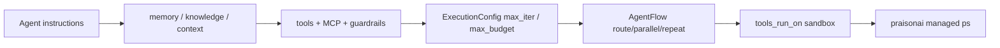

# MervinPraison/PraisonAI

> Framework d'agents Python et YAML couvrant prompt, contexte, harnais, boucle et graphe.

## Le problème
La plupart des frameworks d'agents couvrent un ou deux étages, et quand l'agent dérape on ne sait pas à quel niveau regarder.

## Ce que ça fait vraiment
Organise l'agent en cinq couches nommées : prompt, contexte, harnais, boucle, graphe — chacune avec ses paramètres (`instructions=`, `memory=`, `tools=`, `execution=`, `AgentFlow`).
Détection de boucles infinies par défaut : appels identiques répétés et oscillation A→B→A→B.
`tools_run_on=` déplace seulement les outils vers un sandbox (docker, e2b, modal, daytona, flyio…), `run_on=` déplace l'agent entier.
Le même graphe s'exprime en YAML sans une ligne de Python ; SDK JavaScript disponible.

## Comment c'est branché


## Essayer
```bash
pip install praisonaiagents
export OPENAI_API_KEY="your-api-key"
pip install "praisonai[claw]"
praisonai claw
praisonai agents.yaml
```

## Coût et pièges
`OPENAI_API_KEY` requis dès le premier exemple, `TAVILY_API_KEY` pour le dashboard Claw. Les sandboxes managés (e2b, modal, daytona, flyio) sont des services tiers facturés. `max_budget` existe mais il faut le régler soi-même.

## Ce que ce n'est pas
Pas un produit stable et cadré : la surface est énorme (plus de 25 fonctionnalités, une douzaine de sous-paquets), portée par un mainteneur. L'installation proposée passe par `curl | bash`, à éviter. Le README avertit lui-même de ne jamais mettre `eval()` ou `subprocess` dans un outil.

## Alternatives
Aucune nommée ; le README renvoie aux billets « The Five-Layer Agent Stack » et « Agent Harnesses vs Orbs » pour le cadrage conceptuel.

## Pour toi
Le découpage en cinq couches est un bon modèle mental ; comme dépendance de production, la surface et la gouvernance invitent à la prudence.
