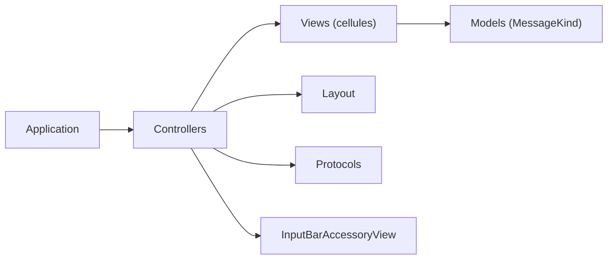

# MessageKit/MessageKit

> Bibliothèque iOS d'interfaces de chat personnalisables, remplaçant communautaire de JSQMessagesViewController.

## Le problème
Écrire une interface de messagerie iOS (bulles, avatars, médias) est long.

## Ce que ça fait vraiment
Fournit `MessagesViewController`, des cellules par type de message (texte, photo, vidéo, lieu, audio, contact, aperçu de lien, personnalisé), des calculateurs de mise en page et des protocoles (`MessagesDataSource`, délégués d'affichage). La barre de saisie vient d'InputBarAccessoryView. Exige iOS 14+ et Swift 6.

## Comment c'est branché


## Essayer
Ajouter le paquet via Swift Package Manager dans Xcode avec l'URL :
```
https://github.com/MessageKit/MessageKit
```

## Coût et pièges
Gratuit. Versions anciennes d'iOS/Swift figées sur d'anciennes versions du paquet. Cellules personnalisées : mise en page entièrement à ta charge.

## Ce que ce n'est pas
Pas un backend de messagerie : uniquement l'affichage.

## Alternatives
Aucune nommée dans le README (JSQMessagesViewController en inspiration).

## Pour toi
À ignorer : bibliothèque d'interface iOS, sans lien avec data/IA/MLOps.

