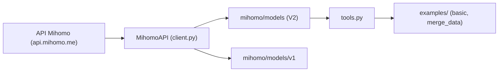

# MetaCubeX/mihomo

> Modèles pydantic typés pour les données Honkai: Star Rail issues de l'API Mihomo, destinés aux développeurs de bots de jeu.

## Le problème
Les données de profil Honkai: Star Rail renvoyées par l'API Mihomo sont du JSON brut, sans typage ni complétion dans l'éditeur.

## Ce que ça fait vraiment
Le README fourni décrit un client asynchrone (MihomoAPI) qui interroge api.mihomo.me/sr_info_parsed/{UID} et parse la réponse en modèles pydantic, en deux formats (V1 et V2). Un module tools fournit remove_duplicate_character et merge_character_data. Les données se sauvegardent en pickle ou en JSON. Anomalie : ce texte correspond au dépôt KT-Yeh/mihomo (installation depuis KT-Yeh), pas à une fiche MetaCubeX.

## Comment c'est branché


## Essayer
```bash
pip install -U git+https://github.com/KT-Yeh/mihomo.git
```

## Coût et pièges
Gratuit, mais dépend d'une API tierce non officielle dont la disponibilité n'est pas garantie. Python asyncio requis pour les exemples.

## Ce que ce n'est pas
Ce n'est pas, d'après ce README, un outil de proxy ou de réseau. Le contenu ne peut pas être rattaché avec certitude au dépôt MetaCubeX/mihomo décrit par le catalogue (34 184 étoiles) : à revérifier à la source.

## Alternatives
Aucune alternative citée dans le README.

## Pour toi
À ignorer : le texte lu concerne un jeu vidéo, hors data/IA/MLOps, et ne correspond pas au dépôt catalogué, donc rien de fiable à en tirer.

