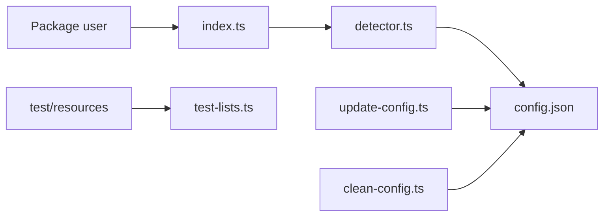

# MetaMask/eth-phishing-detect

> Liste de domaines malveillants visant les utilisateurs Web3, avec outils de maintenance, pour développeurs de portefeuilles et d'extensions.

## Le problème
Les sites qui imitent des services crypto et collectent des clés de signature piègent les utilisateurs ; il faut une liste partagée et maintenue pour les bloquer.

## Ce que ça fait vraiment
- Fournit `src/config.json` : listes de blocage, d'autorisation et « fuzzy » de domaines.
- Un détecteur charge cette configuration et vérifie un domaine fourni (le README indique que le détecteur a été déplacé ailleurs).
- Des CLI ajoutent ou retirent des domaines (`yarn add:blocklist`, `yarn remove:allowlist`…) et nettoient le fichier.
- Des listes de domaines légitimes dans `test/resources` servent de garde-fou contre les faux positifs.

## Comment c'est branché


## Essayer
```bash
yarn add:blocklist crypto-phishing-site.tld
yarn add:allowlist legitimate-site.tld
yarn remove:blocklist legitimate-site.tld
yarn update:lists
git log -S "example.com" -- src/config.json
```

## Coût et pièges
Gratuit. `yarn update:lists` demande une clé d'API CoinMarketCap Pro. Bloquer un domaine déjà présent dans les listes de garde-fou exige un contournement dans `test/test-lists.ts`.

## Ce que ce n'est pas
Ce n'est pas un détecteur autonome : le code de détection est ailleurs. Ce n'est pas une garantie : la liste réagit aux signalements. La licence est présente mais non identifiée par GitHub, à vérifier avant réutilisation.

## Alternatives
Le README cite seulement l'outil de recherche tiers de ChainPatrol, pour savoir pourquoi un domaine est bloqué.

## Pour toi
À surveiller : utile si tu construis une extension ou un front Web3 à protéger, sans lien direct avec un travail data/MLOps ; licence à vérifier d'abord.

