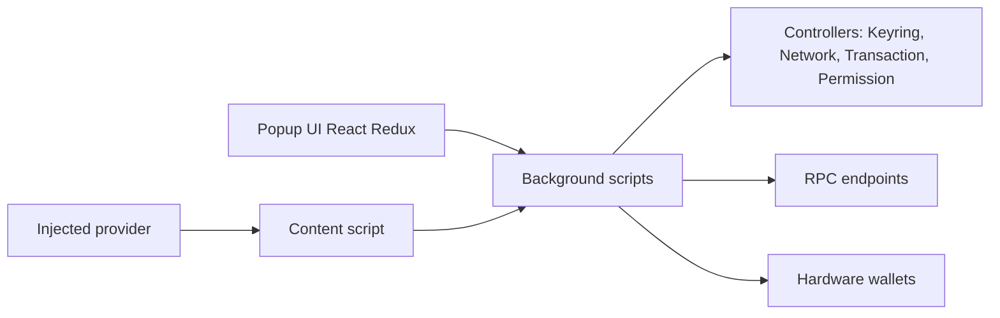

# MetaMask/metamask-extension

> Code source de l'extension de navigateur MetaMask, portefeuille et passerelle vers les applications blockchain, pour développeurs qui la construisent.

## Le problème
Interagir avec des applications décentralisées depuis un navigateur exige un portefeuille qui garde les clés et signe les transactions.

## Ce que ça fait vraiment
Le README de ce dépôt est surtout un guide de contribution : build local avec Yarn, tests unitaires et E2E (Selenium puis Playwright), feature flags distants, mise à jour des politiques LavaMoat. L'architecture décrite d'après le code sépare l'interface React/Redux, les scripts d'arrière-plan avec leurs contrôleurs, et le fournisseur injecté dans les pages. Une section décrit `yarn skills`, qui synchronise localement des skills pour agents (Cursor, Claude Code, Codex).

## Comment c'est branché


## Essayer
```bash
corepack enable
cp .metamaskrc{.dist,}
yarn install
yarn dist
yarn start
yarn test:unit
```
Il faut d'abord remplacer `INFURA_PROJECT_ID` par sa propre clé dans `.metamaskrc`.

## Coût et pièges
Node 24, une clé Infura gratuite, Yarn via Corepack. GitHub Codespaces est facturé au-delà du quota gratuit. La config prévoit des clés Segment (MetaMetrics) et Sentry : de la télémétrie existe dans le produit.

## Ce que ce n'est pas
Ce n'est pas un guide d'utilisation : pour l'utiliser, le README renvoie au site officiel. Ce n'est pas non plus une bibliothèque réutilisable hors du navigateur.

## Alternatives
Aucune alternative nommée dans le README.

## Pour toi
Ignorer : c'est le code d'un portefeuille crypto, hors du travail data/IA ; à ne lire que pour la façon dont l'équipe pilote flags, E2E et politique de dépendances.

