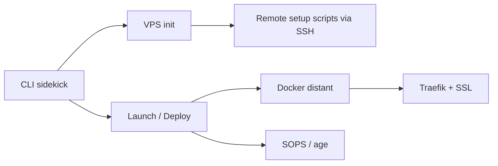

# MightyMoud/sidekick

> Outil en ligne de commande qui prépare un VPS et y déploie des applications Docker sans interruption.

## Le problème
Héberger ses projets perso sur un VPS demande de configurer à la main Docker, SSL, secrets et déploiements sans coupure.

## Ce que ça fait vraiment
`sidekick init` configure un VPS Ubuntu (utilisateur dédié, root désactivé, Docker, Traefik, SSL, sops et age). `sidekick launch` construit l'image en local, la transfère, chiffre le `.env` avec sops et démarre l'application derrière Traefik. `sidekick deploy` publie une nouvelle version sans coupure ; `deploy preview` crée un environnement lié au commit.

## Comment c'est branché


## Essayer
```bash
brew install sidekick
sidekick init
sidekick launch
sidekick deploy
sidekick deploy preview
```

## Coût et pièges
Un VPS Ubuntu (le README cite environ 8 $/mois) et une clé SSH. Homebrew requis en local, aussi utilisé pour installer sops. Dernier push le 2026-02-03.

## Ce que ce n'est pas
Pas un orchestrateur multi-nœuds ; le README évoque haute disponibilité et équilibrage de charge, mais la documentation lue reste sur un seul VPS. Licence GPL-3.0.

## Alternatives
fly.io et Kamal (cités comme inspiration).

## Pour toi
À surveiller : pratique pour un démonstrateur ou un petit service de modèle sur un VPS, sans les garanties d'une plateforme gérée.
