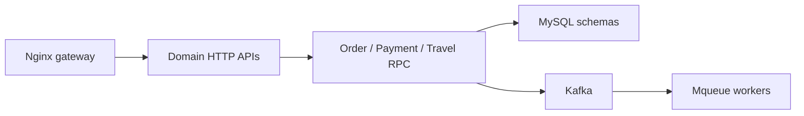

# Mikaelemmmm/go-zero-looklook

> Projet exemple de microservices Go avec go-zero, sur un thème de réservation de logements.

## Le problème
Les débutants en go-zero manquaient d'un exemple complet de projet.

## Ce que ça fait vraiment
Cinq domaines (utilisateurs, voyages, commandes, paiements, file de tâches) en API HTTP plus RPC gRPC, avec Nginx en passerelle. Paiement WeChat, Kafka via go-queue, tâches différées asynq/Redis, logs Filebeat, go-stash puis Elasticsearch, Prometheus, Jaeger. Déploiement documenté avec GitLab, Jenkins, Harbor et Kubernetes. DTM est prévu mais absent du code.

## Comment c'est branché

## Essayer
Le README ne donne aucune commande ; la documentation est dans `doc/english`, et Docker Compose est recommandé en développement.

## Coût et pièges
Pile très large (Kafka, Elasticsearch, Jenkins, Harbor). Dernier push en janvier 2025, plus d'un an. Le README anglais est une traduction approximative.

## Ce que ce n'est pas
Pas une bibliothèque : un exemple pédagogique. Aucun lien avec la data ou l'IA.

## Alternatives
- go-zero, cadre dont il est la démonstration.

## Pour toi
À ignorer : exemple de microservices Go sans rapport avec ton profil, et peu actif depuis plus d'un an.
