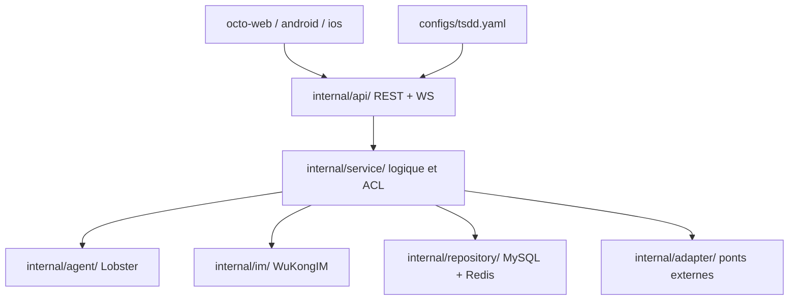

# Mininglamp-OSS/octo-server

> Backend Go d'une plateforme de messagerie où des agents IA participent aux conversations.

## Le problème
Ajouter un agent à un outil de messagerie d'entreprise se fait d'ordinaire par un bot greffé à côté du routage.
L'agent n'est alors ni authentifié, ni autorisé, ni journalisé comme un participant à part entière.

## Ce que ça fait vraiment
Expose des API REST et WebSocket consommées par les clients web, admin, Android et iOS, et pilote le cœur de messagerie WuKongIM par un plan de contrôle mince.
L'orchestration des « Lobsters » — doubles numériques propulsés par OpenClaw — est intégrée au serveur : routage, session et exécution d'appels d'outils.
Chaque requête suit cinq étapes : authentification (jeton, cookie ou trame WebSocket scellée DH), autorisation RBAC consciente de l'organisation, exécution, diffusion IM, réponse JSON unifiée avec traçage.
Stockage enfichable : migrations SQL compatibles MySQL et adaptateurs de stockage objet livrés d'origine.

## Comment c'est branché


## Essayer
```bash
git clone https://github.com/Mininglamp-OSS/octo-server.git
cd octo-server
go build -o octo-server .
./octo-server --config ./configs/tsdd.yaml
```

## Coût et pièges
La configuration de développement attend une instance WuKongIM locale et une base compatible MySQL.
La pile complète (serveur, admin, web, matter, smart-summary, WuKongIM, MySQL, Redis, MinIO, nginx) vit dans un dépôt séparé `octo-deployment` ; les anciens `docker/octo/` et `docker/tsdd/` ont été retirés.

## Ce que ce n'est pas
Pas un produit autonome : c'est une brique parmi neuf dépôts, et l'IM lui-même est WuKongIM.
Pas un projet neuf : c'est un travail dérivé de TangSengDaoDaoServer, sous Apache 2.0, avec un inventaire de licences dans NOTICE.
Pas une plateforme locale complète : le principe « local-first » est affiché, mais les agents reposent sur OpenClaw.

## Alternatives
- TangSengDaoDaoServer : le projet amont, si la couche agent n'est pas nécessaire.
- WuKongIM : le seul cœur de messagerie, si seul le temps réel compte.

## Pour toi
Trop couplé à sa propre pile pour un usage data / IA ; rien n'y est réutilisable isolément.
