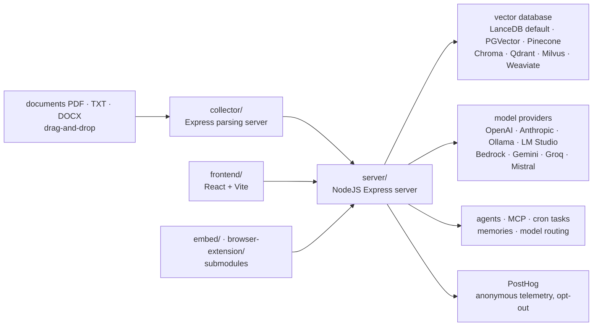

# Mintplex-Labs/anything-llm

> **A self-hosted private ChatGPT: documents, agents and multi-user access in one application.**

## The problem

Standing up an assistant that answers over your own documents means assembling file chunking,
an embedding model, a vector database, a chat UI, user accounts and permissions by hand — and
redoing part of it every time you switch model provider. Each brick is simple; the integration
and its upkeep are not.

## What it actually does

AnythingLLM is a full application, not a library. The README describes a monorepo of six parts:
`frontend` (React + Vite), `server` (Express, handling vector DB management and LLM calls),
`collector` (Express, parsing documents), `docker`, plus the `embed` and `browser-extension`
submodules.

It ingests documents (PDF, TXT, DOCX and more) via drag-and-drop, indexes them in a vector
database and answers with source citations. Work is organised into workspaces, with multi-user
support and permissions — the README marks this as *Docker version only*, as is the embeddable
chat widget.

It also adds its own machinery on top of the models: dynamic model routing by rules you define,
automatic and user-managed memories, scheduled cron tasks with agent capabilities, intelligent
skill selection which the README says cuts token usage by up to 80% per query, a no-code agent
builder, and MCP compatibility.

What it does not do itself: the models. It plugs into a long list of providers (OpenAI, Azure,
Bedrock, Anthropic, Gemini, Ollama, LM Studio, LocalAI, Groq, Mistral, OpenRouter, DeepSeek and
many others), embedders, transcription and TTS engines, and vector stores (LanceDB by default,
PGVector, Pinecone, Chroma, Weaviate, Qdrant, Milvus, Astra, Zilliz). A native embedder and
LanceDB ship with it, which is what makes it run locally by default. A full developer API is
advertised.

## How it is wired



No code-derived diagram exists for this repository: this graph is rebuilt from the README's
"Technical Overview" section, which names the six directories of the monorepo.

## Trying it

```bash
yarn setup
yarn dev:server
yarn dev:frontend
yarn dev:collector
```

These are the only commands the README gives, and they are for **development** (run from the
repo root): `yarn setup` fills in the `.env` files for each section, which must be completed
first — the README stresses `server/.env.development`. For normal use the README documents no
command line at all: it points to deploy buttons (Docker, AWS, GCP, DigitalOcean, Render,
Railway, RepoCloud, Elestio, Northflank, Sealos, Easypanel), to `docker/HOW_TO_USE_DOCKER.md`,
to `BARE_METAL.md` for a non-Docker install, and to the desktop download for Mac, Windows and
Linux.

## Cost and gotchas

- **The software is free (MIT); the models are not.** On a cloud provider the token bill is
  yours; locally (Ollama, LM Studio, llama.cpp, native embedder) the cost is the machine. The
  README gives no VRAM or RAM figures.
- **The desktop build is limited**: multi-user support, permissions and the embeddable chat
  widget are explicitly Docker-only. Choosing desktop means giving up those three.
- **A paid hosted instance exists** from Mintplex Labs (the "Hosted Instance" link) — the
  project's freemium side, with no pricing in the README.
- **Telemetry is on by default.** Anonymous collection via PostHog: install type, document added
  or removed (the event only), vector DB in use, LLM provider and model tag, chat sent. Opt out
  with `DISABLE_TELEMETRY=true` or in-app under sidebar > `Privacy`. The README states no IP or
  identifying information is collected.
- **Outbound connections remain even with telemetry off**: `cdn.anythingllm.com` for the model
  mirror, `github/githubusercontent.com` for context-window files, plus whichever external
  providers you configured.
- **Third-party vector stores**: LanceDB runs locally, but Pinecone, Astra and Zilliz are hosted
  services with accounts and quotas.

## What it is not

- **Not a model or an inference engine.** With no provider wired in — an API key, or Ollama /
  LM Studio alongside — there is nothing to answer with.
- **Not a RAG library you import.** It is an application you deploy, with its own UI and store;
  you integrate through the developer API or the widget, not an `import`. A bespoke ingestion
  pipeline belongs elsewhere.
- **Not free of operational weight**: three services in a monorepo, submodules, telemetry on by
  default and a commercial vendor behind it. "No setup friction" holds for a trial, not for a
  shared instance you must back up, upgrade and watch.

## Alternatives

| | When to prefer it |
|---|---|
| **pipeshub-ai/pipeshub-ai** | Catalogue neighbour, an enterprise AI platform built around connectors to workplace tools. Prefer it when the point is wiring up existing company sources rather than ingesting files dropped in by hand. |
| **Ollama / LM Studio** (named in the README) | Prefer them on their own when you only need to run a local model and chat with it: no vector store, no multi-user, no documents — and nothing to administer. AnythingLLM sits *on top* of them. |

The other neighbours (`xerrors/Yuxi`, `Osmantic/ODS`, `ongridio/ongrid`) are not comparable as
the catalogue stands.

## For you

Adopt it as a ready-made block when you must quickly give a team a shared document assistant:
the integration cost it saves is real, and the local-by-default stack (LanceDB plus the native
embedder) lets you start with no bill and no data leaving the box. For a bespoke RAG pipeline —
chunking, reranking, evaluation — it is a box to pry open rather than a framework: reach for a
library instead. And if the instance will serve several people, plan for Docker from the start
and turn telemetry off before it goes live.
