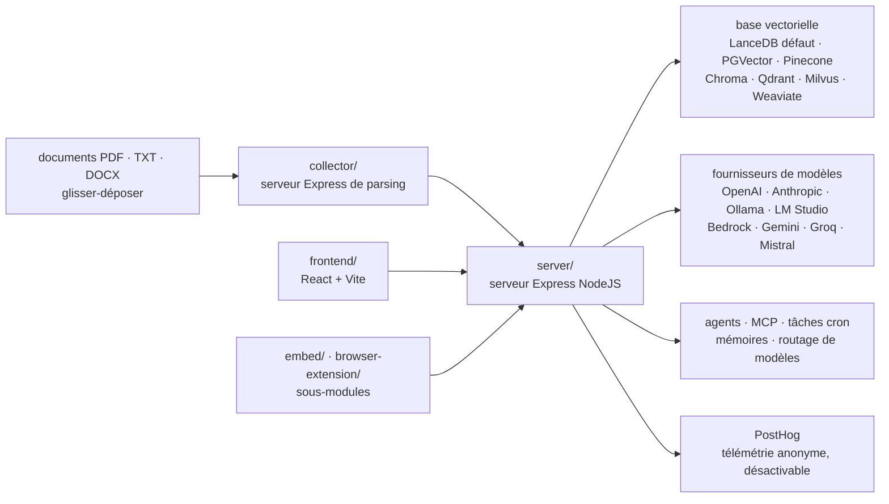

# Mintplex-Labs/anything-llm

> **Un ChatGPT privé à installer soi-même : documents, agents et multi-utilisateurs dans une seule application.**

## Le problème

Monter un assistant qui répond sur ses propres documents suppose d'assembler à la main un
découpage de fichiers, un modèle d'embeddings, une base vectorielle, une interface de chat, la
gestion des utilisateurs et des droits, puis de recommencer à chaque changement de fournisseur
de modèle. Chaque brique est simple, l'intégration ne l'est pas, et la maintenance est à la
charge de celui qui a collé le tout.

## Ce que ça fait vraiment

AnythingLLM est une application complète, pas une bibliothèque : un monorepo de six parties
que le README décrit — `frontend` (React + Vite), `server` (Express, qui pilote la base
vectorielle et les appels aux modèles), `collector` (Express, qui parse et découpe les
documents), `docker`, plus les sous-modules `embed` et `browser-extension`.

Elle ingère des documents (PDF, TXT, DOCX et autres) par glisser-déposer, les indexe dans une
base vectorielle et répond avec citation des sources. Elle organise le travail en *espaces de
travail* (workspaces), avec support multi-utilisateurs et permissions — le README précise que
c'est réservé à la version Docker, tout comme le widget de chat embarquable.

Elle apporte aussi ses propres mécaniques par-dessus les modèles : routage dynamique vers le
fournisseur et le modèle choisis par règles, mémoires automatiques ou gérées par l'utilisateur,
tâches récurrentes en cron avec capacités d'agent, sélection de compétences réduisant, selon le
README, l'usage de jetons « jusqu'à 80 % par requête », constructeur d'agents sans code et
compatibilité MCP.

Ce qu'elle ne fait *pas* elle-même : les modèles. Elle se branche sur une longue liste de
fournisseurs (OpenAI, Azure, Bedrock, Anthropic, Gemini, Ollama, LM Studio, LocalAI, Groq,
Mistral, OpenRouter, DeepSeek…), d'embedders, de moteurs de transcription et de TTS, et de bases
vectorielles (LanceDB par défaut, PGVector, Pinecone, Chroma, Weaviate, Qdrant, Milvus, Astra,
Zilliz). Un embedder natif et LanceDB sont fournis, d'où le fonctionnement local par défaut. Une
API développeur complète est annoncée.

## Comment c'est branché



Aucun diagramme tiré du code n'existe pour ce dépôt : ce schéma est reconstruit depuis la
section « Technical Overview » du README, qui nomme les six répertoires du monorepo.

## Essayer

```bash
yarn setup
yarn dev:server
yarn dev:frontend
yarn dev:collector
```

Ce sont les seules commandes données par le README, et elles concernent le **développement**
(depuis la racine du dépôt) : `yarn setup` remplit les fichiers `.env` de chaque section, à
compléter avant d'aller plus loin — le README insiste sur `server/.env.development`. Pour un
usage normal, le README ne documente aucune ligne de commande : il renvoie aux boutons de
déploiement (Docker, AWS, GCP, DigitalOcean, Render, Railway, RepoCloud, Elestio, Northflank,
Sealos, Easypanel), au fichier `docker/HOW_TO_USE_DOCKER.md`, à `BARE_METAL.md` pour une
installation sans Docker, et au téléchargement de l'application de bureau (Mac, Windows, Linux).

## Coût et pièges

- **Le logiciel est gratuit (MIT), les modèles non.** Sur un fournisseur cloud, la facture de
  jetons est à la charge de l'utilisateur ; en local (Ollama, LM Studio, llama.cpp, embedder
  natif), le coût est la machine. Le README ne chiffre ni VRAM ni RAM.
- **Version de bureau bridée** : multi-utilisateurs, permissions et widget de chat embarquable
  sont explicitement *Docker version only*. Choisir le bureau, c'est renoncer à ces trois points.
- **Une instance hébergée payante existe** chez Mintplex Labs (lien « Hosted Instance ») : c'est
  le modèle freemium du projet, sans grille tarifaire dans le README.
- **Télémétrie activée par défaut.** Collecte anonyme via PostHog : type d'installation, ajout ou
  suppression de document (l'événement seul), base vectorielle utilisée, fournisseur et modèle,
  envoi d'un chat. Désactivation par `DISABLE_TELEMETRY=true` ou depuis la barre latérale
  > `Privacy`. Le README affirme qu'aucune IP ni donnée identifiante n'est collectée.
- **Connexions sortantes même télémétrie coupée** : `cdn.anythingllm.com` pour le miroir des
  modèles, `github/githubusercontent.com` pour des fichiers de contexte, plus les fournisseurs
  externes effectivement configurés.
- **Bases vectorielles tierces** : LanceDB tourne en local, mais Pinecone, Astra ou Zilliz sont
  des services à compte et à quota.

## Ce que ce n'est pas

- **Ce n'est pas un modèle ni un moteur d'inférence.** Sans fournisseur branché — clé d'API ou
  Ollama/LM Studio à côté — l'application n'a rien pour répondre.
- **Ce n'est pas une bibliothèque RAG à importer dans son code.** C'est une application à
  déployer, avec son interface et sa base ; on l'intègre par l'API développeur ou le widget, pas
  par un `import`. Un pipeline d'ingestion sur mesure se construit ailleurs.
- **Ce n'est pas neutre en exploitation** : monorepo à trois services, sous-modules, télémétrie
  par défaut et éditeur commercial derrière. Le « zéro setup » vaut pour l'essai, pas pour une
  instance multi-utilisateurs qu'il faut sauvegarder, mettre à jour et surveiller.

## Alternatives

| | Quand le préférer |
|---|---|
| **pipeshub-ai/pipeshub-ai** | Voisin du catalogue, plateforme d'IA d'entreprise orientée connecteurs vers les outils de travail. À préférer si l'enjeu est de brancher des sources d'entreprise déjà en place plutôt que d'ingérer des fichiers déposés à la main. |
| **Ollama / LM Studio** (nommés dans le README) | À préférer seuls si le besoin se limite à faire tourner un modèle local et discuter avec : pas de base vectorielle, pas de multi-utilisateurs, pas de documents — mais rien à administrer non plus. AnythingLLM se pose *au-dessus* d'eux. |

Les autres voisins (`xerrors/Yuxi`, `Osmantic/ODS`, `ongridio/ongrid`) ne sont pas comparables
en l'état du catalogue.

## Pour toi

À adopter comme brique prête à servir quand il faut livrer vite un assistant documentaire
partagé à une équipe : le coût d'intégration évité est réel, et le socle local par défaut
(LanceDB + embedder natif) permet de démarrer sans facture ni fuite de données. En revanche,
pour un pipeline RAG sur mesure — découpage, reranking, évaluation — c'est une boîte à ouvrir,
pas un cadre : passer par une bibliothèque. Et si l'instance doit servir plusieurs personnes,
prévoir Docker dès le début et couper la télémétrie avant la mise en service.
