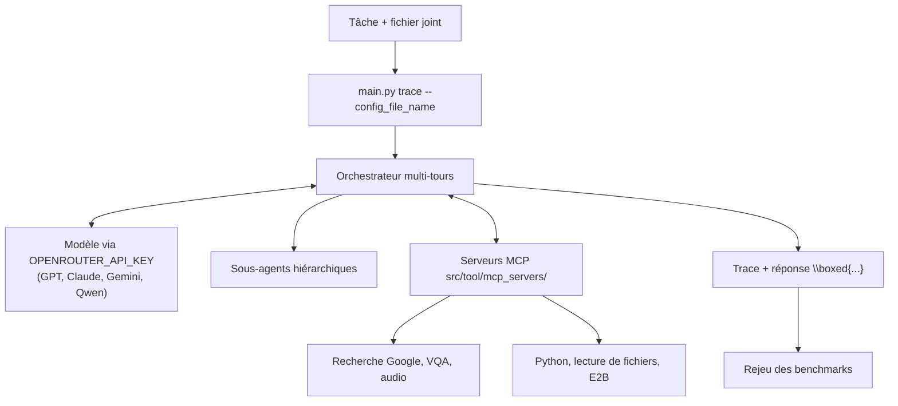

# MiroMindAI/MiroFlow

> **A multi-step internet research agent framework shipped with its own reproducible benchmark protocol.**

## The problem

Getting a model to run a real investigation — search the web, read a file, transcribe audio,
run Python, then cross-check — means writing the tool loop yourself, plus API quota handling,
recovery from flaky networks, and the evaluation harness that tells you whether the new run
is actually better than the last one.

## What it actually does

- Orchestrates a multi-turn research agent: long conversations, tool calls, and hierarchical
  sub-agents that take delegated subtasks.
- Ships its tools as MCP servers inside the repo (`src/tool/mcp_servers/`): audio
  transcription, Python execution, file reading, reasoning, Google search, VQA, plus E2B.
- Stays model-agnostic — GPT, Claude, Gemini and Qwen are listed — with a single OpenRouter
  key as the default entry point.
- Handles concurrency and fault tolerance so rate-limited APIs and unstable networks do not
  break trajectory collection.
- Carries the reproduction path for its evaluations (FutureX, GAIA, HLE, xBench-DeepSearch,
  BrowseComp) and a public GAIA validation trace.
- Is driven by a config file (`--config_file_name`) and accepts an input file alongside the
  task prompt.

## How it is wired

A task enters through `main.py`, the orchestrator loops between the model and the MCP
servers, delegating to sub-agents when needed; the resulting trace feeds the evaluation.



## Trying it

```bash
# 1. Clone and setup
git clone https://github.com/MiroMindAI/MiroFlow && cd MiroFlow
uv sync

# 2. Configure API key
cp .env.template .env
# Edit .env and add your OPENROUTER_API_KEY

# 3. Run your first agent
uv run main.py trace --config_file_name=agent_quickstart_reading --task="What is the first country listed in the XLSX file that have names starting with Co?" --task_file_name="data/FSI-2023-DOWNLOAD.xlsx"
```

## Cost and gotchas

The code is Apache 2.0; running it is not free. You need an OpenRouter key billed per call,
and a multi-turn investigation burns a lot of tokens — the README gives no figure for the
cost of one task or of a full benchmark sweep. Requirements are Python 3.12 or newer, the
`uv` package manager, and Linux or macOS; Windows is not listed. Google search, VQA and E2B
imply their own credentials, which the README does not detail. The "research agent on a
single RTX 4090" claim runs through the MiroThinker model, which lives in another repo.

## What it is not

It is not a model: MiroFlow is the orchestration layer, the reasoning comes from a third-party
model called over an API (MiroThinker and the MiroVerse dataset are separate repos). It is
not a turnkey service either — a hosted demo exists, but the repo gives you a command-line
runner, not an application to deploy for a team. And the reported scores are the vendor's own
numbers from the vendor's own runs.

## Alternatives

- **MiroMindAI/MiroThinker** — the tool-use reasoning model from the same team: pick it when
  you want the agent running on your own GPU instead of paying per API call; it complements
  MiroFlow rather than replacing it.
- The other neighbours in the batch are not comparable: `mlflow/mlflow` tracks experiments and
  models, `Capsize-Games/airunner` is a local generation app, and `vectorize-io/hindsight`
  is not in the research-agent orchestration space.

## For you

Worth watching if you are building a research agent and want an evaluation protocol that is
already written, rather than yet another orchestration loop — the value here is benchmark
reproducibility, not the tool loop itself. Skip it if you need a production assistant for end
users: the repo stays a command-line test bench.
