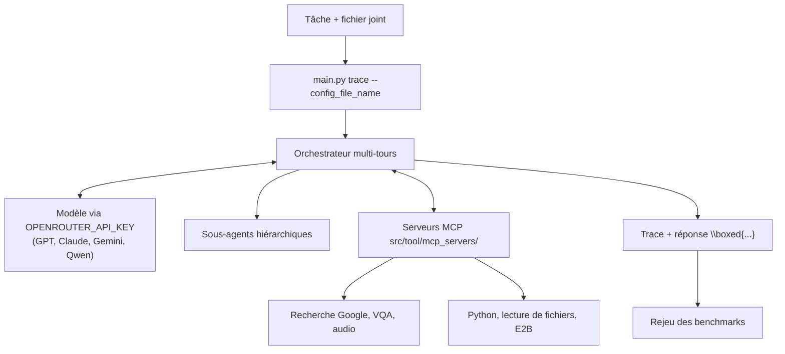

# MiroMindAI/MiroFlow

> **Cadre d'agent de recherche multi-étapes sur Internet, livré avec ses scores de référence reproductibles.**

## Le problème

Faire mener à un modèle une enquête en plusieurs tours — chercher sur le web, lire un fichier,
transcrire un audio, exécuter du Python, puis recouper — suppose d'écrire soi-même la boucle
d'outils, la gestion des quotas d'API, la reprise après échec réseau et le protocole
d'évaluation qui permettra de dire si le résultat est meilleur que le précédent.

## Ce que ça fait vraiment

- Orchestre un agent de recherche multi-tours : conversation longue, appels d'outils,
  et sous-agents hiérarchiques auxquels une tâche est déléguée.
- Fournit ses outils sous forme de serveurs MCP présents dans le dépôt
  (`src/tool/mcp_servers/`) : transcription audio, exécution Python, lecture de fichiers,
  raisonnement, recherche Google, VQA, plus E2B.
- Reste indépendant du modèle : GPT, Claude, Gemini, Qwen sont cités, l'entrée par défaut
  passant par une clé OpenRouter unique.
- Gère la concurrence et la tolérance aux pannes pour encaisser les API à quota et les
  réseaux instables pendant la collecte de trajectoires.
- Embarque le protocole de reproduction des évaluations (FutureX, GAIA, HLE,
  xBench-DeepSearch, BrowseComp) et une trace publique de validation GAIA.
- Se pilote par fichier de configuration (`--config_file_name`) et prend un fichier de travail
  en entrée de la tâche.

## Comment c'est branché

Une tâche entre par `main.py`, l'orchestrateur boucle entre le modèle et les serveurs MCP,
et délègue au besoin à des sous-agents ; la trace de l'exécution sert ensuite d'évaluation.



## Essayer

```bash
# 1. Clone and setup
git clone https://github.com/MiroMindAI/MiroFlow && cd MiroFlow
uv sync

# 2. Configure API key
cp .env.template .env
# Edit .env and add your OPENROUTER_API_KEY

# 3. Run your first agent
uv run main.py trace --config_file_name=agent_quickstart_reading --task="What is the first country listed in the XLSX file that have names starting with Co?" --task_file_name="data/FSI-2023-DOWNLOAD.xlsx"
```

## Coût et pièges

Le code est sous Apache 2.0, mais l'usage ne l'est pas : il faut une clé OpenRouter, facturée
à l'appel, et une enquête multi-tours consomme beaucoup de jetons — le README ne chiffre ni le
coût d'une tâche ni celui d'un passage complet de benchmark. Python 3.12 ou plus, le
gestionnaire `uv`, Linux ou macOS : Windows n'est pas listé. La recherche Google, la VQA et
E2B supposent leurs propres accès, non détaillés ici. La variante « un agent sur une seule
RTX 4090 » passe par le modèle MiroThinker, qui vit dans un autre dépôt.

## Ce que ce n'est pas

Ce n'est pas un modèle : MiroFlow est la couche d'orchestration, le raisonnement vient d'un
modèle tiers appelé par API (MiroThinker et le jeu de données MiroVerse sont des dépôts
séparés). Ce n'est pas non plus un service clé en main — la démo hébergée existe, mais le
dépôt donne un exécutable en ligne de commande, pas une application à déployer pour une
équipe. Et les scores annoncés sont ceux de l'éditeur sur ses propres exécutions.

## Alternatives

- **MiroMindAI/MiroThinker** — le modèle entraîné pour le raisonnement outillé, du même
  éditeur : à prendre si l'on veut faire tourner l'agent sur son propre GPU plutôt que de
  payer des appels d'API ; complémentaire de MiroFlow plus que concurrent.
- Les autres voisins du lot ne sont pas comparables : `mlflow/mlflow` suit des expériences et
  des modèles, `Capsize-Games/airunner` est une application locale de génération, et
  `vectorize-io/hindsight` ne relève pas de l'orchestration d'agents de recherche.

## Pour toi

À surveiller si tu construis un agent de recherche et que tu veux un protocole d'évaluation
déjà écrit plutôt qu'un énième cadre d'orchestration : la valeur ici est la reproductibilité
des benchmarks, pas la boucle d'outils. À laisser si ton besoin est un assistant en production
pour des utilisateurs — le dépôt reste un banc d'essai piloté en ligne de commande.
