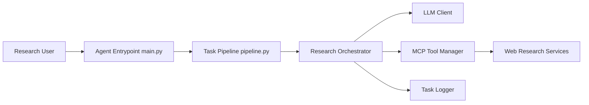

# MiroMindAI/MiroThinker

> Modèles d'agent de recherche approfondie (30B, 235B) et framework MiroFlow pour les exécuter et les évaluer.

## Le problème
Les agents de recherche ouverts tiennent mal les longues chaînes d'appels d'outils et restent derrière les offres commerciales.

## Ce que ça fait vraiment
Modèles MiroThinker (dérivés de Qwen3) avec 256K de contexte et jusqu'à 300 appels d'outils par tâche, servis via SGLang ou vLLM. Le framework `apps/miroflow-agent` enchaîne raisonnement LLM et serveurs MCP (sandbox E2B, recherche Serper, scraping Jina avec LLM résumeur) et ne garde que les K derniers résultats d'outils en contexte. Scripts d'évaluation sur une douzaine de benchmarks et collecte de traces pour SFT/DPO.

## Comment c'est branché


## Essayer
```bash
git clone https://github.com/MiroMindAI/MiroThinker
cd MiroThinker/apps/miroflow-agent
uv sync
cp .env.example .env
uv run python main.py llm=qwen-3 agent=mirothinker_1.7_keep5_max200 llm.base_url=http://localhost:61002/v1
```

## Coût et pièges
Trois services tiers obligatoires même en config minimale (Serper, Jina, E2B) plus un LLM résumeur ; OpenAI pour les évaluations. Servir le modèle suppose plusieurs GPU (exemple avec 4).

## Ce que ce n'est pas
Pas un agent autonome hors ligne : la recherche dépend d'API payantes. MiroThinker-H1, le plus performant, est propriétaire.

## Alternatives
Aucune alternative nommée ; les agents cités (WebThinker, WebSailor…) n'apparaissent que dans les tableaux de scores.

## Pour toi
À surveiller : l'astuce « garder les K derniers résultats d'outils » et la suite d'évaluation sont réutilisables, mais la dépendance à trois SaaS et le coût GPU limitent l'adoption directe.
