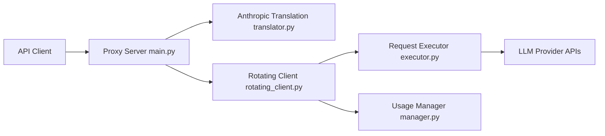

# Mirrowel/LLM-API-Key-Proxy

> Proxy auto-hébergé exposant des API compatibles OpenAI et Anthropic devant plusieurs fournisseurs, avec rotation de clés.

## Le problème
Chaque outil (Claude Code, Cursor, Continue) est lié à un fournisseur, et les limites de débit d'une clé bloquent les usages intensifs.

## Ce que ça fait vraiment
Une application FastAPI avec `/v1/chat/completions` et `/v1/messages`. Le préfixe `provider/modèle` route vers Gemini, OpenAI, Anthropic, OpenRouter ou tout fournisseur géré par LiteLLM. Rotation de clés, basculement sur erreur, temps de refroidissement croissants, quotas par groupe de modèles, suivi d'usage et TUI. Bibliothèque `rotator_library` réutilisable. Fournisseur Gemini CLI via OAuth.

## Comment c'est branché


## Essayer
```bash
cp .env.example .env
mkdir usage
docker compose up -d
# puis pointer le client sur http://127.0.0.1:8000/v1 avec PROXY_API_KEY
```

## Coût et pièges
Les appels restent facturés par chaque fournisseur. Il faut fournir ses propres clés et un `PROXY_API_KEY`. Le fournisseur Gemini CLI passe par des identifiants OAuth : vérifier les conditions d'usage de Google. Le proxy écoute par défaut sur 0.0.0.0.

## Ce que ce n'est pas
Pas un outil gratuit d'accès aux modèles : il ne fournit aucun crédit. Multiplier des comptes pour contourner des quotas peut enfreindre des conditions de service. Statistiques d'usage encore en alpha.

## Alternatives
Aucune alternative nommée dans le README (LiteLLM est utilisé comme couche de repli).

## Pour toi
À adopter pour tester : un point d'entrée unique pour tes clients de code et notebooks, facile à lancer avec Docker ; vérifie d'abord la licence et limite l'exposition réseau.
