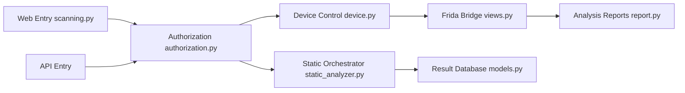

# MobSF/Mobile-Security-Framework-MobSF

> Plateforme d'analyse de sécurité d'applications mobiles Android, iOS et Windows, pour chercheurs et équipes CI.

## Le problème
Auditer une application mobile (binaire ou code source) demande d'enchaîner des outils d'analyse statique, d'instrumentation à l'exécution et de rapports, sans cadre commun.

## Ce que ça fait vraiment
Application Django : on soumet un APK, IPA, APPX ou du code source par l'interface web ou l'API REST. L'analyse statique parse les artefacts, applique des contrôles de sécurité et de malware, et stocke les résultats. L'analyse dynamique (Android et iOS) pilote un appareil ou Corellium, injecte des scripts Frida et peut observer le trafic réseau. Des rapports sont générés ; le README annonce une intégration CI/CD par API et CLI. Le schéma d'architecture reconnaît lui-même une part d'inférence.

## Comment c'est branché


## Essayer
```bash
docker pull opensecurity/mobile-security-framework-mobsf:latest
docker run -it --rm -p 8000:8000 opensecurity/mobile-security-framework-mobsf:latest

# Default username and password: mobsf/mobsf
```

## Coût et pièges
Gratuit, licence GPL-3.0 (copyleft). Docker requis pour la voie rapide. Identifiants par défaut mobsf/mobsf : à changer avant toute exposition réseau. L'analyse dynamique suppose un appareil, un émulateur ou Corellium, non détaillés dans le README.

## Ce que ce n'est pas
Ce n'est pas un scanner à lancer sur des applications qu'on n'a pas le droit d'analyser : le README parle de recherche, de test d'intrusion et d'analyse de malware, ce qui suppose un cadre autorisé. Le README est succinct (les sections d'illustrations sont vides ici) ; le détail est dans la documentation externe.

## Alternatives
- mobsfscan : la variante du projet pour l'intégration CI/CD.
- mobsf.live : version en ligne de l'analyseur statique.

## Pour toi
À surveiller : pertinent seulement si tu audites des applications mobiles ou intègres de la sécurité mobile en CI ; hors de ce cas, aucun lien avec un flux data/IA.

