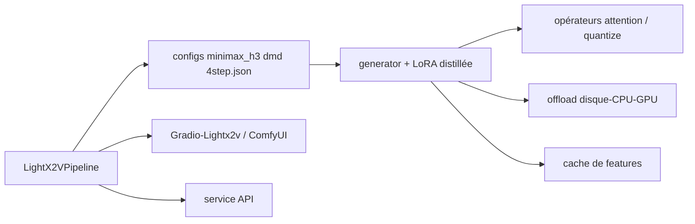

# ModelTC/LightX2V

> Framework d'inférence léger pour la génération d'images et de vidéos, pour qui doit servir ces modèles.

## Le problème
Générer une vidéo en 40 à 50 pas de diffusion coûte cher et ne tient pas sur une carte grand public.
Chaque famille de modèles vient avec son propre pipeline d'inférence.

## Ce que ça fait vraiment
Plateforme unifiée pour T2V, I2V, T2I et édition d'images, derrière une API `LightX2VPipeline`.
Distillation en 4 pas sans CFG, quantification `w8a8-int8`, `w8a8-fp8`, `w4a4-nvfp4`,
offloading à trois niveaux disque-CPU-GPU par phase et par bloc, cache de features, inférence
parallèle multi-GPU, résolution dynamique.
Opérateurs intégrés : Sage Attention, Flash Attention, Radial Attention, q8-kernel, sgl-kernel, vllm.
Modèles servis : MiniMax-H3, LTX-2 et 2.3, HunyuanVideo-1.5, Wan2.1/2.2, SeedVR2, SwiftVR,
Qwen-Image et ses variantes Edit, plus des LoRA distillés et des modèles autorégressifs.

## Comment c'est branché


## Essayer
```bash
pip install -v git+https://github.com/ModelTC/LightX2V.git
git clone https://github.com/ModelTC/LightX2V.git && uv pip install -v .
python examples/minimax_h3/minimax_h3_t2av_dmd.py
python examples/wan/wan_i2v_nvfp4.py
```

## Coût et pièges
Gratuit, mais c'est du GPU : les mesures sont faites sur H100 et RTX 4090D, et les concurrents
tombent en OOM là où LightX2V passe. Le plancher annoncé est 8 Go de VRAM et 16 Go de RAM pour un
modèle 14B en 480p/720p. Docker est la voie recommandée. Les opérateurs NVFP4 se compilent à part
(`lightx2v_kernel/README.md`). L'interface Gradio a déménagé dans un autre dépôt.

## Ce que ce n'est pas
Ce n'est pas un modèle : les poids viennent de HuggingFace, sous leurs licences propres.
Ce n'est pas une interface : Gradio, ComfyUI et le déploiement Windows sont des couches séparées.
Les chiffres de vitesse sont des mesures de l'équipe, sur une configuration précise (Wan2.1-I2V-14B-480P,
40 pas, 81 frames).

## Alternatives
Diffusers, xDiT, FastVideo et SGL-Diffusion, comparés chiffres en main ; Atlas Cloud pour une API managée.

## Pour toi
À garder si tu dois servir de la génération vidéo sur du matériel contraint ; sinon, hors sujet.
