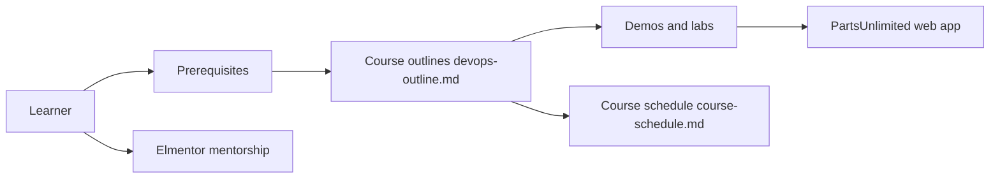

# MohamedRadwan-DevOps/devops-step-by-step

> Parcours de cours DevOps en ligne, du socle informatique à Azure DevOps et Terraform, avec mentorat associé.

## Le problème
Les débutants cherchent une progression structurée vers le DevOps plutôt qu'une pile de tutoriels épars.

## Ce que ça fait vraiment
Le dépôt organise quatre parcours : introduction à l'informatique, fondamentaux du génie logiciel et DevOps, DevOps Microsoft (préparation à certification) et Terraform. Chaque parcours renvoie à des plans, objectifs, démos et FAQ. Il présente aussi un programme de mentorat externe (Elmentor) et des guides de contribution. Le code d'exemple visible est une application web PartsUnlimited, sans lien précisé avec un cours.

## Comment c'est branché


## Essayer
Aucune commande : le README n'en documente pas. Il s'agit de parcourir les dossiers de cours.
```bash
# non documenté : aucune commande dans le README
```

## Coût et pièges
Lecture gratuite. Le mentorat passe par une plateforme séparée, dont les conditions ne figurent pas dans le README. Aucune licence déclarée : le réemploi du contenu n'est pas garanti.

## Ce que ce n'est pas
Pas un outil ni un cours pour data / IA : le contenu est du DevOps généraliste et Azure. Rien n'indique que les labs soient testés.

## Alternatives
Aucune alternative nommée dans le README.

## Pour toi
À ignorer : peu de rapport avec ton profil data/IA/MLOps (cours généraliste centré Azure et Terraform), et l'absence de licence limite la réutilisation.
