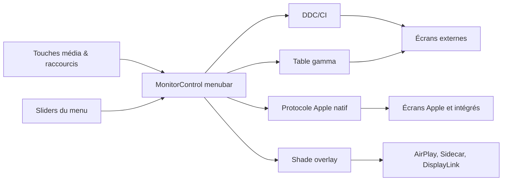

# MonitorControl/MonitorControl

> **A macOS menubar utility that drives brightness, volume and contrast on external displays.**

## The problem

On macOS, the keyboard brightness and volume keys only talk to the built-in screen and to
Apple displays. Plug in a third-party monitor and you are back to the physical buttons on the
panel, a vendor OSD menu, and no synchronisation across the screens of a single desk. The
README claims to solve nothing beyond that gap.

## What it actually does

The app adds a menubar extra with sliders, and intercepts Apple media keys or custom keyboard
shortcuts. It adjusts brightness, volume and contrast through several protocols depending on
the target: DDC/CI for external displays over USB-C, DisplayPort, HDMI, DVI or VGA; the
native Apple protocol for Apple and built-in screens; the gamma table for software dimming;
a shade (overlay) for AirPlay, Sidecar and DisplayLink virtual screens. It shows the native
macOS OSD, combines hardware and software dimming to go below the panel's minimum and down to
full black, mirrors ambient-light-sensor changes from an Apple screen onto a third-party one,
and syncs every display from a single slider. The README advertises "dozens" of tweaks behind
a `Show advanced settings` checkbox.

## How it is wired



No code-derived diagram is available for this repository: the graph above is inferred from
the README alone. It shows the app's pivot point — depending on the detected display type,
the same user command is routed to a hardware protocol (DDC, native Apple) or to a software
fallback (gamma, shade). Third-party building blocks listed: MediaKeyTap for key capture,
SimplyCoreAudio for audio, sindresorhus' KeyboardShortcuts and Settings, Sparkle for updates.

## Trying it

```shell
brew install --cask monitorcontrol
```

Otherwise download the `.dmg` from the Releases page, copy the app into `Applications`, launch
it, and add it to `Accessibility` under `System Settings » Privacy & Security` — required only
if you want the native Apple brightness and media keys. To build from source:

```sh
git clone https://github.com/MonitorControl/MonitorControl.git
```

then open `MonitorControl.xcodeproj` in Xcode (Xcode, Swiftlint, SwiftFormat and BartyCrouch
are listed as build requirements).

## Cost and traps

Free, MIT, no API key and no third-party service. The real cost is hardware compatibility, and
the README states it plainly: no DDC on the built-in HDMI port of the 2018 Intel Mac mini, of
all M1 Macs (14" and 16" MacBook Pro, Mac mini, Mac Studio) and of the entry-level M2 Mac mini
— use USB-C, otherwise you fall back to software dimming. DisplayLink docks and dongles do not
allow DDC on Macs. Some displays, EIZO named explicitly, use MCCS over USB or a fully custom
protocol and get software dimming only. LCD and LED televisions usually do not implement DDC.
On the OS side: macOS Catalina 10.15 minimum with limitations, Big Sur 11 for full
functionality, v4.4.0 or newer for macOS 27, and on macOS Tahoe the native OSD appears but the
percentage value neither shows nor updates. Accessibility access is a system permission to
grant.

## What it is not

It is not a resolution or display-arrangement manager: the app sets levels, not display modes.
It is not a guarantee of hardware control — when DDC is unavailable the fallback is software
dimming (gamma or shade), which darkens the rendered image without touching the backlight, so
no contrast or power gain. It is also not the full-featured option: the README itself points to
BetterDisplay for XDR/HDR brightness upscaling, more Mac models and DDC over HDMI. Finally it
is macOS only, with no Windows or Linux equivalent.

## Alternatives

- **waydabber/BetterDisplay** — recommended by the README itself for XDR/HDR brightness
  upscaling, DDC over HDMI on Apple Silicon Macs and broader hardware coverage; prefer it if
  MonitorControl hits a wall on your machine.
- **alin23/Lunar** — named in the credits, another macOS DDC controller, oriented toward
  automating brightness from ambient light and time of day.
- **Bensge/NativeDisplayBrightness** — the ancestor some code was taken from; mostly of
  historical interest, only worth it for a minimal need.
- **jordanbaird/Ice** — a catalogue neighbour, but it manages menubar clutter, not displays:
  it is not a substitute.

## For you

No connection to a data or MLOps pipeline: this is workstation comfort. But if you spend your
days on a Mac with two or three third-party panels, MIT-licensed, free, 34,000 stars and a
software fallback when DDC is missing, that is ten minutes of setup against a daily irritant.
Check the HDMI exception list first before counting on hardware control.
