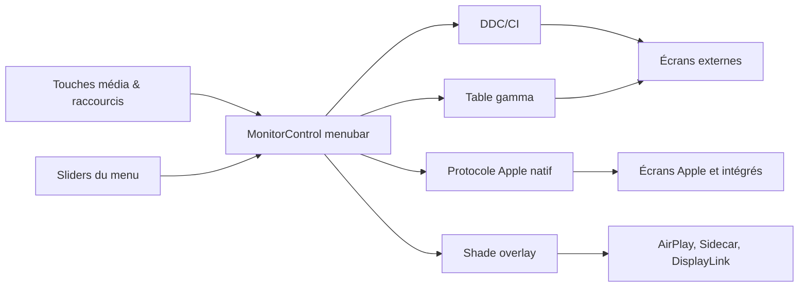

# MonitorControl/MonitorControl

> **Utilitaire macOS de menubar qui pilote luminosité, volume et contraste des écrans externes.**

## Le problème

Sur macOS, les touches de luminosité et de volume du clavier ne parlent qu'à l'écran intégré
et aux écrans Apple. Branché sur un moniteur tiers, on retombe sur les boutons physiques de
la dalle, un menu OSD constructeur, et aucune synchronisation entre les écrans d'un même
poste. Le README ne prétend rien résoudre d'autre que cet écart.

## Ce que ça fait vraiment

L'app ajoute un extra de menubar avec des sliders, et intercepte les touches média Apple ou
des raccourcis clavier personnalisés. Elle règle luminosité, volume et contraste en passant
par plusieurs protocoles selon la cible : DDC/CI pour les écrans externes via USB-C,
DisplayPort, HDMI, DVI ou VGA ; le protocole Apple natif pour les écrans Apple et intégrés ;
la table gamma pour un assombrissement logiciel ; un voile (shade, overlay) pour AirPlay,
Sidecar et DisplayLink. Elle affiche l'OSD natif de macOS, combine assombrissement matériel
et logiciel pour descendre sous le minimum de la dalle jusqu'au noir complet, réplique sur un
écran tiers les variations du capteur de lumière ambiante d'un écran Apple, et synchronise
tous les écrans depuis un slider unique. Le README revendique « des dizaines » d'options de
réglage, derrière une case `Show advanced settings`.

## Comment c'est branché



Aucun diagramme tiré du code n'est disponible pour ce dépôt : ce schéma est déduit du seul
README. Il montre le point de bascule de l'app — selon le type d'écran détecté, la même
commande utilisateur part vers un protocole matériel (DDC, Apple natif) ou vers une
dégradation logicielle (gamma, voile). Les briques tierces citées : MediaKeyTap pour la
capture des touches, SimplyCoreAudio pour l'audio, KeyboardShortcuts et Settings de
sindresorhus, Sparkle pour la mise à jour.

## Essayer

```shell
brew install --cask monitorcontrol
```

Sinon, télécharger le `.dmg` depuis la page Releases, copier l'app dans `Applications`, la
lancer, et l'ajouter à `Accessibility` dans `Réglages Système » Confidentialité et sécurité`
— étape requise uniquement pour utiliser les touches clavier Apple natives. Pour compiler :

```sh
git clone https://github.com/MonitorControl/MonitorControl.git
```

puis ouvrir `MonitorControl.xcodeproj` dans Xcode (Xcode, Swiftlint, SwiftFormat et
BartyCrouch sont listés comme prérequis de build).

## Coût et pièges

Gratuit, MIT, pas de clé d'API ni de service tiers. Le vrai coût est en compatibilité
matérielle, et le README l'expose sans détour : pas de DDC sur le port HDMI intégré du Mac
mini Intel 2018, de tous les Macs M1 (MacBook Pro 14 et 16 pouces, Mac mini, Mac Studio) et
du Mac mini M2 d'entrée de gamme — il faut passer par USB-C, sinon on retombe sur
l'assombrissement logiciel. Les docks DisplayLink n'autorisent pas le DDC. Certains écrans,
EIZO cité nommément, utilisent MCCS sur USB ou un protocole propriétaire et n'ont que le
logiciel. Les téléviseurs LCD et LED n'implémentent généralement pas DDC. Côté OS : macOS
Catalina 10.15 minimum avec des limitations, Big Sur 11 pour la fonctionnalité complète,
v4.4.0 ou plus récent pour macOS 27, et sur macOS Tahoe l'OSD natif apparaît mais le
pourcentage ne s'affiche ni ne se met à jour. L'accès Accessibilité est une permission
système à accorder.

## Ce que ce n'est pas

Ce n'est pas un gestionnaire de résolutions ni d'arrangement d'écrans : l'app règle des
niveaux, pas des modes d'affichage. Ce n'est pas une garantie de contrôle matériel — quand
DDC n'est pas disponible, le repli est un assombrissement logiciel (gamma ou voile) qui
réduit l'image affichée sans toucher au rétroéclairage, donc sans gain de contraste ni de
consommation. Ce n'est pas non plus la version complète : le README renvoie lui-même vers
BetterDisplay pour la montée en luminosité XDR/HDR, plus de modèles de Mac et le DDC sur
HDPI HDMI. Enfin, c'est macOS uniquement, sans équivalent Windows ou Linux.

## Alternatives

- **waydabber/BetterDisplay** — recommandé par le README lui-même pour l'upscaling de
  luminosité XDR/HDR, le DDC sur HDMI des Macs Apple Silicon et un parc matériel plus large ;
  à préférer si MonitorControl bute sur votre machine.
- **alin23/Lunar** — cité dans les crédits, autre contrôleur DDC macOS, orienté automatisation
  de la luminosité selon la lumière ambiante et l'heure.
- **Bensge/NativeDisplayBrightness** — l'ancêtre dont du code a été repris ; intérêt surtout
  historique, à ne choisir que pour un besoin minimal.
- **jordanbaird/Ice** — voisin du catalogue, mais il gère l'encombrement de la barre de menus,
  pas les écrans : ce n'est pas un substitut.

## Pour toi

Aucun rapport avec une chaîne data ou MLOps : c'est du confort de poste de travail. Mais si
tu passes tes journées sur un Mac avec deux ou trois dalles tierces, MIT, gratuit, 34 000
étoiles et un repli logiciel quand le DDC manque, c'est dix minutes d'installation pour un
irritant quotidien. Vérifie d'abord la liste des exceptions HDMI avant d'y croire.
