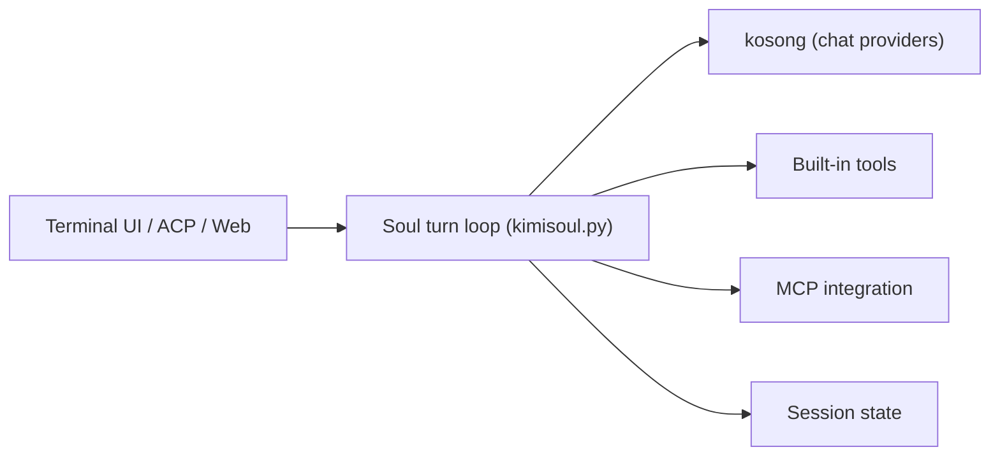

# MoonshotAI/kimi-cli

> Agent IA en terminal qui lit et modifie du code et lance des commandes, en cours d'arrêt.

## Le problème
Les tâches de développement et d'exploitation demandent de jongler entre éditeur, shell et recherche web.

## Ce que ça fait vraiment
Un agent dont la boucle (« soul ») assemble le contexte, appelle des outils locaux (fichiers, shell, web) et un modèle. Il s'exécute en terminal, en serveur ACP pour Zed/JetBrains, ou en interface web. Supporte MCP, plugins, skills et sous-agents. Le README annonce qu'il évolue vers Kimi Code CLI et sera peu à peu arrêté.

## Comment c'est branché


## Essayer
```bash
kimi mcp add --transport http context7 https://mcp.context7.com/mcp --header "CONTEXT7_API_KEY: ctx7sk-your-key"
kimi mcp list
kimi --mcp-config-file /path/to/mcp.json
```
Commandes d'installation non données dans ce README.

## Coût et pièges
Une connexion (`/login`) ou une clé d'API est nécessaire ; le coût n'est pas précisé. Le projet est en fin de vie annoncée.

## Ce que ce n'est pas
Pas un projet appelé à durer : le README annonce un arrêt progressif au profit de Kimi Code CLI. Les commandes shell intégrées comme `cd` ne sont pas gérées en mode shell.

## Alternatives
Kimi Code CLI, successeur annoncé ; les autres agents ne sont pas nommés.

## Pour toi
Surveiller le successeur plutôt que celui-ci : le projet est en arrêt annoncé, donc mauvais investissement pour un outil durable.

