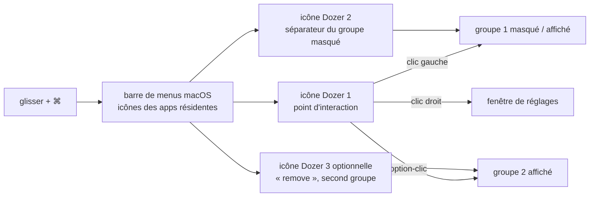

# Mortennn/Dozer

> **Une petite app macOS qui replie les icônes encombrantes de la barre de menus.**

## Le problème

Sur un Mac, chaque application résidente ajoute son icône dans la barre de menus, et celle-ci
finit par déborder — d'autant plus vite sur un portable dont l'encoche mange la place. macOS
ne propose rien pour en masquer une partie : on garde tout sous les yeux, ou on désinstalle.

## Ce que ça fait vraiment

Dozer ajoute deux, et optionnellement trois, icônes noires dans la barre de menus, numérotées
de droite à gauche. La première est un simple point d'interaction, à placer où l'on veut. Tout
ce qui se trouve à gauche de la deuxième est masqué ou réaffiché d'un clic gauche sur
n'importe quelle icône Dozer. Une troisième icône facultative, dite « remove », définit un
second groupe que l'on déplie par option-clic.

Le rangement se fait donc à la main : on déplace les icônes des autres applications de part et
d'autre des séparateurs Dozer, en maintenant la touche commande (`⌘`) pendant le glissement.
Le clic droit sur une icône Dozer ouvre les réglages. Le README ne documente rien d'autre :
ni options listées, ni raccourcis clavier, ni format de configuration.

## Comment c'est branché



Aucun diagramme tiré du code n'existe pour ce dépôt : ce schéma est reconstruit depuis le seul
README, qui ne cite aucun nom de fichier source. Il décrit le modèle d'interaction, pas
l'architecture Swift de l'application.

## Essayer

```bash
brew install --cask dozer
```

Le README donne cette seule commande. L'autre voie documentée n'en est pas une : télécharger
la dernière *release*, l'ouvrir et glisser l'app dans le dossier Applications.

## Coût et pièges

- **Gratuit, sans compte ni clé** : le README n'annonce aucun service tiers, aucun quota, aucune
  version bridée. Un lien « Buy Me A Coffee » figure en tête, à titre de don.
- **macOS uniquement, 10.13+ (High Sierra)** : les badges et la section Requirements du README
  le posent comme seule exigence. Rien sur Apple Silicon, ni sur les versions récentes de macOS.
- **Licence MPL-2.0** : copyleft de fichier. Sans conséquence pour un simple usage, mais à lire
  avant de redistribuer une version modifiée.
- **Distribution hors App Store** : le README ne mentionne ni signature ni notarisation ; le
  premier lancement d'un binaire téléchargé peut donc demander une manipulation, non documentée.
- **Le rangement reste manuel** : rien n'automatise le classement des icônes, il faut les
  déplacer une à une.

## Ce que ce n'est pas

- **Ce n'est pas un gestionnaire de fenêtres ni un lanceur** : Dozer ne touche qu'aux icônes de
  la barre de menus, il ne range pas les fenêtres et n'ouvre pas d'applications.
- **Ce n'est pas un outil en ligne de commande ni une bibliothèque** : rien à importer, rien à
  scripter — le README ne documente aucune API, aucun fichier de configuration, aucun réglage
  détaillé.
- **Ce n'est pas un projet d'équipe** : un auteur unique, un don en guise de modèle économique,
  et un README dont la démonstration animée est commentée « en attendant d'être refaite ».

## Alternatives

- **jordanbaird/Ice** — même fonction, gestion des icônes de la barre de menus macOS ; à
  préférer si l'on cherche un projet plus récemment actif ou davantage d'options de réglage,
  Dozer restant le choix minimal et déjà installable en une commande Homebrew.
- **DamascenoRafael/reminders-menubar** — également une app de barre de menus macOS, mais pour
  afficher les rappels : complémentaire, pas concurrente.
- Les autres voisins du catalogue (`darrylmorley/whatcable`, `gouwsxander/Reef`) ne sont pas
  comparables.

## Pour toi

Aucun rapport avec la data, l'IA ou le MLOps : c'est un confort de poste de travail, pas un
outil de métier. À retenir seulement si tu travailles sur un Mac dont la barre de menus déborde
entre Docker, le VPN, les indicateurs de GPU et les clients de synchronisation — auquel cas
c'est une commande Homebrew et cinq minutes de rangement. Sinon, passe ton chemin.
