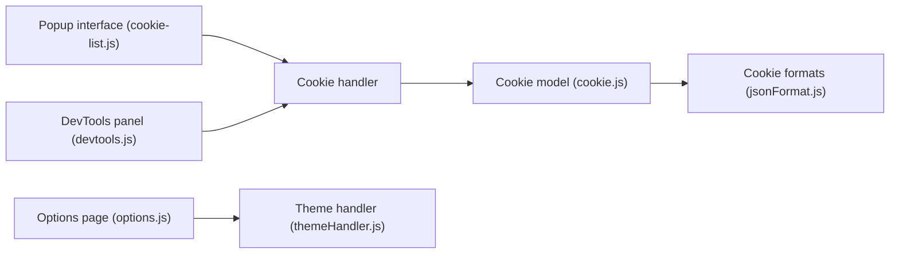

# Moustachauve/cookie-editor

> Extension de navigateur pour créer, modifier et supprimer les cookies de l'onglet courant.

## Le problème
Inspecter et modifier les cookies d'une page pour développer, tester ou gérer sa vie privée passe mal par les outils de base.

## Ce que ça fait vraiment
- Création, édition, suppression, suppression en masse des cookies du site visité.
- Export dans plusieurs formats (JSON, en-tête, Netscape).
- Panneau popup, DevTools, volet latéral, interface mobile.
- Chrome, Firefox, Safari, Edge, Opera.

## Comment c'est branché


## Essayer
```bash
npm install
grunt
```
Les fichiers sortent dans `dist`. Safari se compile dans Xcode.

## Coût et pièges
Gratuit ; le graphe mentionne un sélecteur de publicités (adHandler.js), non détaillé dans le README. Droits de lecture des cookies à accorder.

## Ce que ce n'est pas
Pas un gestionnaire de mots de passe ; ne touche que le site courant.

## Alternatives
Aucune alternative nommée dans le README.

## Pour toi
À surveiller : pratique pour déboguer des sessions de dashboards ou d'API web, sinon accessoire.

