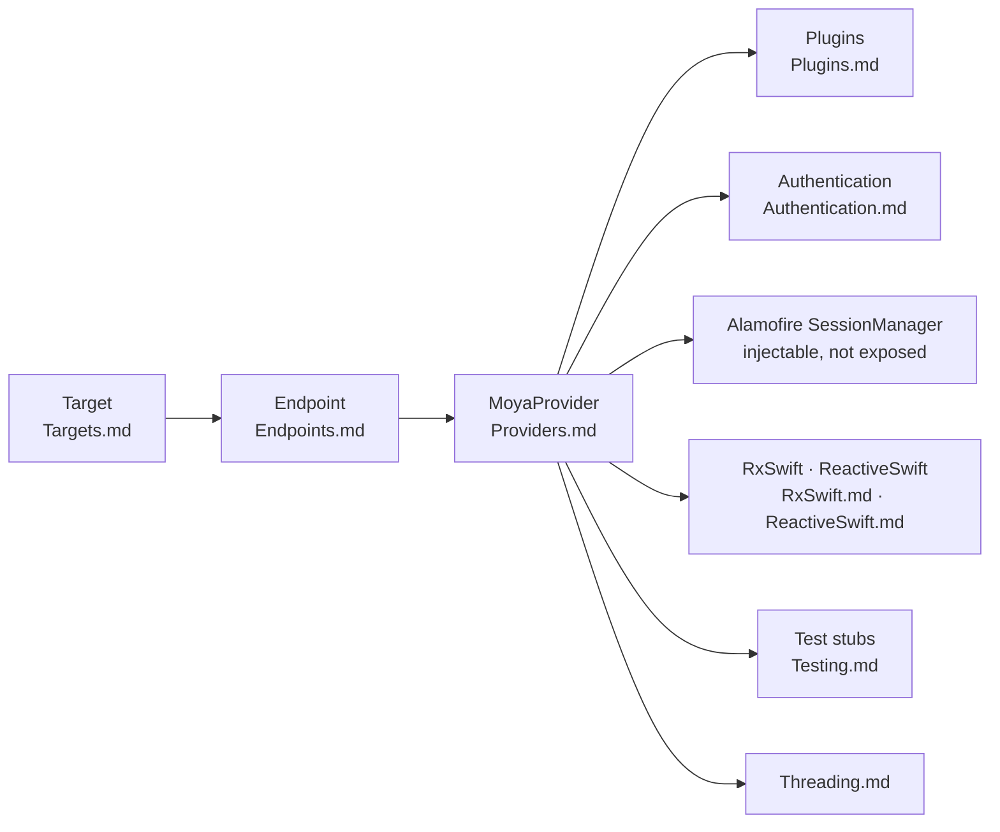

# Moya/Moya

> **A Swift networking layer that hides Alamofire behind a typed description of your API calls.**

## The problem

Without it, every network call in a Swift app is written at the Alamofire level: URLs
assembled by hand, headers, parameter encoding, decoding, and test code that has to
intercept the HTTP layer to fake responses. Low-level details scatter across the app.

## What it actually does

This repository's README is a **documentation index**, not a product page. It states one
stance — working at a "high level of abstraction" — and shows a *pipeline* as an image
(`web/pipeline.png`) that is never spelled out in text.

What it genuinely documents is the list of pages naming the building blocks: Targets,
Endpoints, Providers, Authentication, ReactiveSwift, RxSwift, Threading, Plugins, Testing.
The explicit point: you should **not** have to reference Alamofire directly, while the door
stays open — a `SessionManager` can be passed to the `MoyaProvider` initializer. The README
also claims that changing Moya's behaviour rarely requires modifying the library.

Installation, versions and code samples are **not documented here**.

## How it is wired

No code-derived diagram exists for this repository. The graph below is rebuilt from the page
names the README lists; it does not claim to mirror the source files.



## Trying it

The README contains **no commands** at all: no install, no build, no code sample. Nothing was
copyable, and nothing has been reconstructed.

```bash
# No command is documented in this README.
# Its only entry point is reading the companion pages
# (Targets.md, Endpoints.md, Providers.md, …) and, for questions,
# opening an issue: http://github.com/Moya/Moya/issues/new
```

## Cost and gotchas

- **Free, MIT licence** (from the catalogue, not from this README): no account, no API key,
  no third-party service, no quota.
- **The real cost is buying into a mental model.** The README says so itself: less a framework
  *of code* than a framework of *how to think* about network requests. Describing every API as
  a `Target` type is structural, and not free to undo.
- **Alamofire dependency**: hidden, not removed. The README owns this and provides the escape
  hatch (`SessionManager` passed to `MoyaProvider`), which still assumes knowing the layer
  underneath the day something breaks.
- **Documentation gotcha**: this README gives no version, no package manager, no Swift
  compatibility range. All of that must be found elsewhere in the repository.

## What it is not

- **Not an HTTP client**: Moya does not talk to the network, Alamofire does. It is a
  description and routing layer above it.
- **Not polyglot**: it is Swift, for the Apple ecosystem. Nothing here is usable from Python,
  Node or a server-side service.
- **This README is not the project's front page**: it indexes the documentation folder.
  Reading it as a full overview wrongly suggests the project documents neither install nor
  usage.

## Alternatives

| | When to prefer it |
|---|---|
| **Alamofire/Alamofire** | Named explicitly in the README, it is the layer Moya covers. Prefer it to drive HTTP requests directly, without a typed intermediary; prefer Moya to describe the API rather than transport it. |
| **ReactiveX/RxSwift** | Named in the README (`RxSwift.md`): not a competitor but an optional integration, worth adding if the app is already reactive. |

The other catalogue neighbours (`DebugSwift/DebugSwift`, `realm/SwiftLint`) share the language
but not the subject: debugging and static analysis, not networking. No comparable alternative
beyond the two named above.

## For you

Skip it for a data / AI / MLOps profile: this is an iOS/macOS application brick with no
contact point with training, model serving or data tooling. The only transferable idea is the
discipline — describing an API as an enumerated type instead of scattered URL strings — and
that reads in ten minutes without adopting the library.
