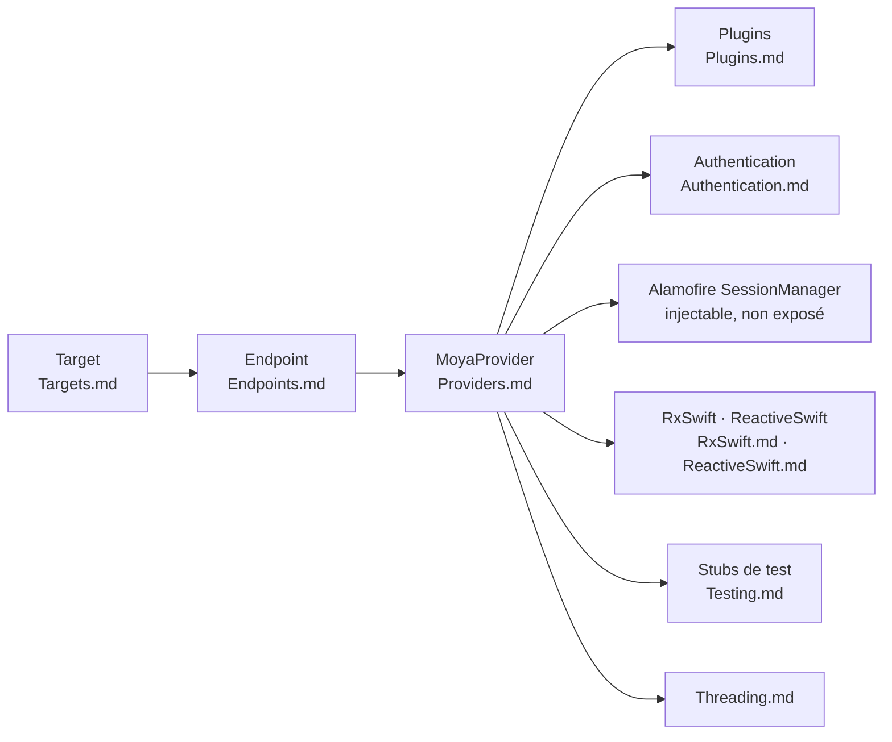

# Moya/Moya

> **Couche réseau Swift qui cache Alamofire derrière une description typée des appels d'API.**

## Le problème

Sans elle, chaque appel réseau d'une application Swift se rédige au niveau d'Alamofire :
URL assemblée à la main, en-têtes, encodage des paramètres, décodage, et un code de test qui
doit intercepter la couche HTTP pour simuler des réponses. Les détails bas niveau se
dispersent dans tout le code applicatif.

## Ce que ça fait vraiment

Le README de ce dépôt est une **page d'index de documentation**, pas une présentation
produit : il annonce un parti pris — travailler « à haut niveau d'abstraction » — et un
*pipeline*, illustré par une image (`web/pipeline.png`) qui n'est pas retranscrite en texte.

Ce qu'il documente réellement tient dans les pages qu'il liste et qui nomment les briques :
Targets, Endpoints, Providers, Authentication, ReactiveSwift, RxSwift, Threading, Plugins,
Testing. Le point explicite du README : on ne devrait **pas** avoir à référencer Alamofire
directement, tout en gardant la porte ouverte — un `SessionManager` peut être passé à
l'initialiseur de `MoyaProvider`. Le README affirme aussi que modifier le comportement de
Moya se fait sans modifier la bibliothèque.

Le reste (installation, versions, exemple de code) n'est **pas documenté ici**.

## Comment c'est branché

Aucun diagramme tiré du code n'existe pour ce dépôt. Le schéma ci-dessous est reconstruit
depuis les seuls noms de pages listés par le README ; il ne prétend pas refléter les fichiers
sources.



## Essayer

Le README ne contient **aucune commande** : ni installation, ni build, ni exemple de code.
Rien n'est donc copiable ici, et rien n'a été reconstruit.

```bash
# Aucune commande n'est documentée dans ce README.
# Le seul point d'entrée qu'il donne est la lecture des pages associées
# (Targets.md, Endpoints.md, Providers.md, …) et, en cas de question,
# l'ouverture d'un ticket : http://github.com/Moya/Moya/issues/new
```

## Coût et pièges

- **Gratuit, licence MIT** (relevée dans le catalogue, pas dans ce README) : aucun compte,
  aucune clé d'API, aucun service tiers, aucun quota.
- **Le coût réel est l'adhésion à un modèle mental.** Le README le dit lui-même : « moins un
  cadriciel *de code* qu'un cadriciel de *façon de penser* » les requêtes réseau. Décrire
  chaque API comme un type `Target` est structurant, et pas gratuit à défaire.
- **Dépendance à Alamofire** : masquée, pas supprimée. Le README l'assume et prévoit
  l'échappatoire (`SessionManager` passé au `MoyaProvider`), ce qui suppose de connaître
  quand même la couche du dessous le jour où ça coince.
- **Piège documentaire** : ce README n'indique ni version, ni gestionnaire de paquets, ni
  compatibilité Swift. Tout cela est à chercher ailleurs dans le dépôt.

## Ce que ce n'est pas

- **Ce n'est pas un client HTTP** : Moya ne parle pas au réseau, Alamofire le fait. C'est une
  couche de description et d'aiguillage au-dessus.
- **Ce n'est pas un outil polyglotte** : c'est du Swift, pour l'écosystème Apple. Rien ici ne
  s'utilise depuis Python, Node ou un service serveur.
- **Ce README n'est pas la page d'accueil du projet** : c'est l'index du dossier de
  documentation. Le prendre pour une présentation complète conduit à conclure, à tort, que le
  projet ne documente ni son installation ni son usage.

## Alternatives

| | Quand le préférer |
|---|---|
| **Alamofire/Alamofire** | Nommé explicitement dans le README, c'est la couche que Moya recouvre. À préférer quand on veut piloter la requête HTTP directement, sans intermédiaire typé ; Moya à préférer quand on veut décrire l'API plutôt que la transporter. |
| **ReactiveX/RxSwift** | Nommé dans le README (page `RxSwift.md`) : ce n'est pas un concurrent mais une intégration facultative, à ajouter si l'application est déjà réactive. |

Les autres voisins du catalogue (`DebugSwift/DebugSwift`, `realm/SwiftLint`) partagent le
langage mais pas le sujet : débogage et analyse statique, pas couche réseau. Aucune
alternative comparable au-delà de celles nommées ci-dessus.

## Pour toi

À ignorer pour un profil data / IA / MLOps : c'est une brique d'application iOS/macOS, sans
point de contact avec l'entraînement, le service de modèles ou l'outillage de données. Le
seul intérêt transférable est la discipline — décrire une API par un type énuméré plutôt que
par des chaînes d'URL éparpillées — et elle se lit en dix minutes sans adopter la
bibliothèque.
