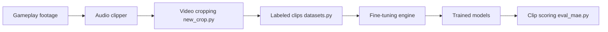

# Mr-Homeless/waldo

> Application locale qui note la probabilité de triche sur des extraits vidéo de Counter-Strike 2, avec un modèle à entraîner soi-même.

## Le problème
Repérer de la triche à l'aimbot sur des vidéos de jeu demande de revoir à la main des centaines de séquences.

## Ce que ça fait vraiment
Application web Flask locale : détecte les frags par l'audio, extrait des clips de 2 secondes, permet d'étiqueter « tricheur » ou non, entraîne ou affine un modèle VideoMAE v2 (transformeur de vision d'un milliard de paramètres), puis note les clips de 0 à 1 avec visualisation des 16 images analysées et export JSON. Traitement local, sans envoi de données.

## Comment c'est branché


## Essayer
```bash
git clone https://github.com/Mr-Homeless/waldo.git
cd waldo
chmod +x install.sh
./install.sh
./run.sh
# puis ouvrir http://localhost:5000
```

## Coût et pièges
GPU NVIDIA avec CUDA, 16 à 32 Go de RAM, environ 10 Go disque, checkpoint de 1,9 Go depuis HuggingFace. Le script Linux est signalé comme non testé. Les modèles plus précis de l'auteur sont proposés sur Patreon.

## Ce que ce n'est pas
Pas un détecteur prêt à l'emploi : il exige un modèle entraîné sur tes propres clips étiquetés (au moins 48). Un score n'est pas une preuve de triche, et accuser un joueur sur cette base serait risqué. Limité à CS2.

## Alternatives
Aucune alternative nommée dans le README.

## Pour toi
À ignorer : peu de fiabilité démontrée (alpha, aucune métrique publiée, données à labelliser soi-même), et sans licence ; seul l'exemple de fine-tuning VideoMAE peut instruire.
