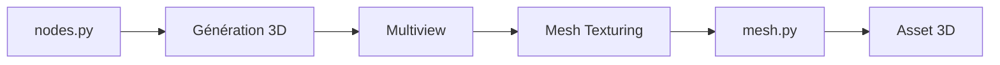

# MrForExample/ComfyUI-3D-Pack

> Suite de nœuds ComfyUI pour générer et traiter des assets 3D (mesh, texture, 3DGS) à partir d'images.

## Le problème
Les modèles de génération 3D récents ont chacun leur dépôt et leur pipeline ; les enchaîner demande du code ad hoc.

## Ce que ça fait vraiment
Expose dans ComfyUI des modèles d'image vers 3D (Hunyuan3D, TRELLIS, TripoSG, InstantMesh, Wonder3D, PartCrafter…), du multivue, du texturage, du 3D Gaussian Splatting et des rendus orbitaux. Export .obj, .ply, .glb. L'architecture lue ne confirme pas le câblage de chaque branche.

## Comment c'est branché


## Essayer
```bash
cd Your ComfyUI Root Directory\ComfyUI\custom_nodes\
git clone https://github.com/MrForExample/ComfyUI-3D-Pack.git
cd ComfyUI-3D-Pack
Your ComfyUI Root Directory\python_embeded\python.exe -s -m pip install -r requirements.txt
Your ComfyUI Root Directory\python_embeded\python.exe install.py
```

## Coût et pièges
GPU CUDA ; pré-builds pour Windows, Python 3.12, CUDA 12.4, torch 2.5.1. Sinon compilation (Visual Studio Build Tools ou gcc/g++). Era3D demande 16 Go de VRAM ; certains poids exigent d'accepter des conditions (StableFast3D).

## Ce que ce n'est pas
Pas un seul modèle : chaque poids a sa propre licence, distincte du MIT du dépôt.

## Alternatives
Les dépôts sources des modèles eux-mêmes (TRELLIS, Hunyuan3D, TripoSR) si tu n'utilises pas ComfyUI.

## Pour toi
Utile si tu fais de la 3D générative sur GPU local ; installation lourde : surveiller.

