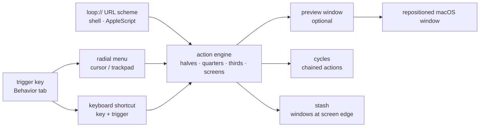

# MrKai77/Loop

> **A macOS window manager driven by a radial menu and shortcuts, for people juggling many windows.**

## The problem

On macOS, sending a window to the left half, the top third or the next display is mouse work,
one window at a time, with nothing remembered afterwards. Native shortcuts cover a handful of
cases and stop there; everything beyond is paid proprietary territory.

## What it actually does

Loop hinges on a **trigger key** (set in the "Behavior" tab of Settings, one key or several)
that you hold to open a **radial menu**: move the cursor in a direction and the window snaps
there. A **preview window** shows the result of the resize *before* you commit to it.

That same trigger key pairs with any keyboard key to fire an action directly. The README lists
the catalogue: fullscreen, maximize, almost maximize, centre, halves, quarters, horizontal and
vertical thirds, screen switching (next, previous, left, right, top, bottom), grow/shrink/move
on each edge, initial frame, undo, custom, cycle.

Two mechanics go further: **cycles**, which chain several manipulations by repeating the same
key combination or left-click, and **stash**, which parks windows at the screen edge, recalled
by hovering or by keybind. Loop also exposes a **`loop://` URL scheme** drivable from shell or
AppleScript, so sequences can be scripted.

Radial menu and preview are both customisable (width, shape, colour, padding, corner radius,
border) and both independently switchable off.

## How it is wired

No code-derived diagram exists for this repository: the graph below is reconstructed from the
README alone, so it names no source files.



## Trying it

```bash
brew install loop
```

Then, once the app runs, the control commands given by the README:

```bash
# Shell examples
open "loop://direction/right"     # Move window to right half
open "loop://action/maximize"     # Maximize window
open "loop://screen/next"         # Move to next screen

# AppleScript examples
osascript -e 'tell application "Loop" to activate'
osascript -e 'open location "loop://direction/left"'
```

```bash
open "loop://list/all"           # List all commands
open "loop://list/actions"       # List window actions
open "loop://list/keybinds"      # List custom keybinds
```

## Cost and gotchas

- **macOS 13 or later, only.** Stated under the download button. Nothing for Linux or Windows,
  nothing to run on a server.
- **Free and open source**, no API key, no account, no third-party service: the README's
  comparison table lists "Free" for Loop against $4.99 to $16.00 for Magnet, Moom, Swish,
  BetterTouchTool or Rectangle Pro.
- **GNU GPLv3**: copyleft. Reusing Loop's code inside a proprietary product is not an option;
  for plain use it changes nothing.
- **Caps Lock as trigger is not native**: the README gives three workarounds — remap Caps Lock
  to Control in System Settings (*repeat for every connected keyboard*), use Hyperkey or
  Karabiner Elements, or drive Loop by script.
- **Accessibility permissions** are not documented in the README, although moving other apps'
  windows normally requires them on macOS. Expect to grant them at install time.
- **No workspace saving**: the README's table marks ❌ for "Save Workspace", as well as for
  trackpad gestures, pinning windows on top and resizing adjacent windows.

## What it is not

- **Not a tiling window manager** like yabai or AeroSpace: Loop places the focused window on
  demand, it does not maintain a window tree or automatically tiled workspaces.
- **Not a general automation tool**: the `loop://` scheme drives Loop's window actions and
  nothing else; the README itself inserts `sleep 0.5` between two calls, so sequencing is not
  guaranteed.
- **Not cross-platform and not a data tool**: this is desktop comfort, on Mac only. The hidden
  cost is learning the trigger key and its combinations.

## Alternatives

| | When to prefer it |
|---|---|
| **Rectangle** (named in the README table) | Free and open source too, but no radial menu, no theming, no stash. Prefer it if all you want is halves/quarters shortcuts with nothing to configure. |
| **yabai** / **AeroSpace** (named in the README table) | Genuine tiling managers, free, keyboard-driven. Prefer them if you want the layout *managed* continuously rather than triggered window by window. |
| **Hammerspoon** (named in the README table) | Free and scriptable in Lua, and it ticks "Save Workspace" where Loop does not. Prefer it if layouts must be described in code and restored. |

The catalogue neighbours (`momenbasel/PureMac`, `productdevbook/port-killer`, `buresdv/Cork`,
`jaywcjlove/DevHub`) are macOS tools as well, but none of them manage windows: no comparison
can be drawn.

## For you

Nothing to do with data, AI or MLOps: this is a workstation tool, and a Mac-only one. Watch it
rather than adopt it as a building block — unless your main machine is a Mac and your day is
spent between a notebook, a terminal, a dashboard and a video call, in which case the radial
menu and cycles replace paid window management for free. On Linux or WSL, walk past.
