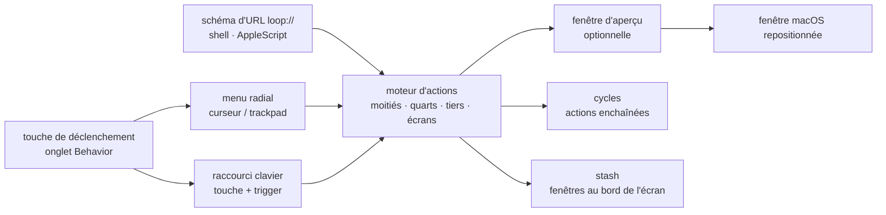

# MrKai77/Loop

> **Gestionnaire de fenêtres macOS piloté par un menu radial et des raccourcis, pour qui jongle avec beaucoup de fenêtres.**

## Le problème

Sur macOS, placer une fenêtre à la moitié gauche, au tiers haut ou sur l'écran voisin se fait
à la souris, fenêtre par fenêtre, sans rien garder de la disposition obtenue. Les raccourcis
natifs couvrent quelques cas et s'arrêtent là ; le reste se paie en outils propriétaires.

## Ce que ça fait vraiment

Loop repose sur une **touche de déclenchement** (configurable dans l'onglet « Behavior » des
réglages, simple ou combinée) qu'on maintient pour ouvrir un **menu radial** : on bouge le
curseur dans une direction, la fenêtre s'y range. Une **fenêtre d'aperçu** montre le résultat
du redimensionnement *avant* de valider.

La même touche de déclenchement se combine à n'importe quelle touche du clavier pour lancer
une action directement. Le catalogue d'actions est énuméré dans le README : plein écran,
maximiser, centrer, moitiés, quarts, tiers horizontaux et verticaux, changement d'écran
(suivant, précédent, gauche, droite, haut, bas), agrandir/rétrécir/déplacer côté par côté,
cadre initial, annuler, personnalisé, cycle.

Deux mécaniques vont plus loin : les **cycles**, qui enchaînent plusieurs manipulations en
répétant la même combinaison ou le même clic, et le **stash**, qui range des fenêtres au bord
de l'écran, rappelées par survol ou par raccourci. Enfin, Loop expose un **schéma d'URL
`loop://`** pilotable en shell ou en AppleScript, ce qui permet de scripter des enchaînements.

Le menu radial et l'aperçu sont personnalisables (largeur, forme, couleur, marge, rayon des
coins, bordure) et tous deux désactivables indépendamment.

## Comment c'est branché

Aucun diagramme tiré du code n'existe pour ce dépôt : ce schéma est reconstruit depuis le seul
README, et ne nomme donc pas de fichiers source.



## Essayer

```bash
brew install loop
```

Puis, une fois l'app lancée, les commandes de pilotage données par le README :

```bash
# Shell examples
open "loop://direction/right"     # Move window to right half
open "loop://action/maximize"     # Maximize window
open "loop://screen/next"         # Move to next screen

# AppleScript examples
osascript -e 'tell application "Loop" to activate'
osascript -e 'open location "loop://direction/left"'
```

```bash
open "loop://list/all"           # List all commands
open "loop://list/actions"       # List window actions
open "loop://list/keybinds"      # List custom keybinds
```

## Coût et pièges

- **macOS 13 ou plus récent, exclusivement.** Le README l'annonce sous le bouton de
  téléchargement. Rien pour Linux ni Windows, et rien à en tirer sur un serveur.
- **Gratuit et open source**, sans clé d'API, sans compte, sans service tiers : la colonne
  « Price » du tableau de comparaison du README donne « Free » pour Loop, contre 4,99 à 16 $
  pour Magnet, Moom, Swish, BetterTouchTool ou Rectangle Pro.
- **Licence GNU GPLv3** : copyleft. Réutiliser du code de Loop dans un produit propriétaire
  n'est pas une option ; pour un usage tel quel, aucune conséquence.
- **Caps Lock comme déclencheur n'est pas natif** : le README décrit trois contournements —
  remapper Caps Lock vers Control dans les réglages système (*à refaire pour chaque clavier
  connecté*), passer par Hyperkey ou Karabiner Elements, ou piloter par script.
- **Permissions d'accessibilité** : non documentées dans le README, bien que déplacer les
  fenêtres d'autres applications l'exige normalement sur macOS. À vérifier à l'installation.
- **Pas de sauvegarde d'espace de travail** : le tableau du README coche explicitement ❌ pour
  « Save Workspace », ainsi que pour les gestes trackpad, l'épinglage au premier plan et le
  redimensionnement des fenêtres adjacentes.

## Ce que ce n'est pas

- **Ce n'est pas un gestionnaire de fenêtres en mosaïque** à la yabai ou AeroSpace : Loop range
  la fenêtre active à la demande, il ne gère pas un arbre de fenêtres ni des espaces de travail
  pavés automatiquement.
- **Ce n'est pas un outil d'automatisation générale** : le schéma `loop://` pilote les actions
  de fenêtres de Loop, rien d'autre ; le README montre un `sleep 0.5` entre deux appels, donc
  aucune garantie de séquencement.
- **Ce n'est pas multiplateforme et ce n'est pas un outil de travail data** : c'est du confort
  de poste, sur Mac uniquement. Le coût caché est l'apprentissage de la touche de déclenchement
  et de ses combinaisons.

## Alternatives

| | Quand le préférer |
|---|---|
| **Rectangle** (nommé dans le tableau du README) | Gratuit et open source lui aussi, mais sans menu radial, sans thème, sans stash. À préférer si on veut seulement des raccourcis moitiés/quarts et rien à configurer. |
| **yabai** / **AeroSpace** (nommés dans le tableau du README) | Vrais gestionnaires en mosaïque, gratuits, pilotables au clavier. À préférer si on veut que la disposition soit *gérée* en permanence plutôt que déclenchée fenêtre par fenêtre. |
| **Hammerspoon** (nommé dans le tableau du README) | Gratuit et scriptable en Lua, il coche « Save Workspace » là où Loop ne le fait pas. À préférer si la disposition doit être décrite en code et restaurée. |

Les voisins du catalogue (`momenbasel/PureMac`, `productdevbook/port-killer`, `buresdv/Cork`,
`jaywcjlove/DevHub`) sont eux aussi des outils macOS, mais aucun ne gère les fenêtres : pas de
comparaison possible.

## Pour toi

Sans rapport avec la data, l'IA ou le MLOps : c'est un outil de poste de travail, et seulement
sur Mac. À surveiller, pas à adopter comme brique — sauf si ton poste principal est un Mac et
que tu passes tes journées entre un notebook, un terminal, un tableau de bord et une
visioconférence : là, le menu radial et les cycles remplacent une gestion de fenêtres payante,
gratuitement. Sur Linux ou WSL, passe ton chemin.
