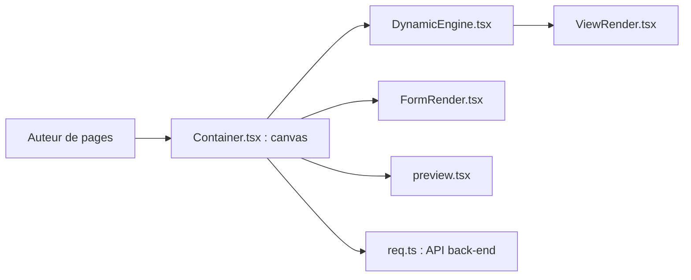

# MrXujiang/h5-Dooring

> Éditeur visuel low-code en React pour construire des pages H5 par glisser-déposer.

## Le problème
Produire des pages promotionnelles mobiles sans développeur front-end.

## Ce que ça fait vraiment
Éditeur à base de composants (base, médias, produits, visuels) avec canvas, panneau de configuration, concepteur de formulaires, animations, interactions, sources de données, aperçu et bibliothèque de modèles. Un back-end Koa gère œuvres, utilisateurs et collecte de formulaires. Le README renvoie vers des produits liés de l'auteur.

## Comment c'est branché


## Essayer
```bash
git clone https://github.com/MrXujiang/h5-Dooring.git
cd ./h5-Dooring
yarn pkg
yarn start
```
Puis ouvrir http://localhost:port/h5_plus.

## Coût et pièges
Gratuit. Sous Windows, le README renvoie vers dooring-electron. Documentation et démo en partie en chinois ; README bourré de liens vers d'autres produits de l'auteur.

## Ce que ce n'est pas
Pas un outil de visualisation de données ni un tableau de bord. Licence GPL-3.0 : contraignante pour une redistribution.

## Alternatives
- V6.Dooring : éditeur d'écrans de visualisation, du même auteur.
- dooring-electron-lowcode : version de bureau.

## Pour toi
À ignorer : générateur de pages marketing, sans lien avec data/IA/MLOps.

