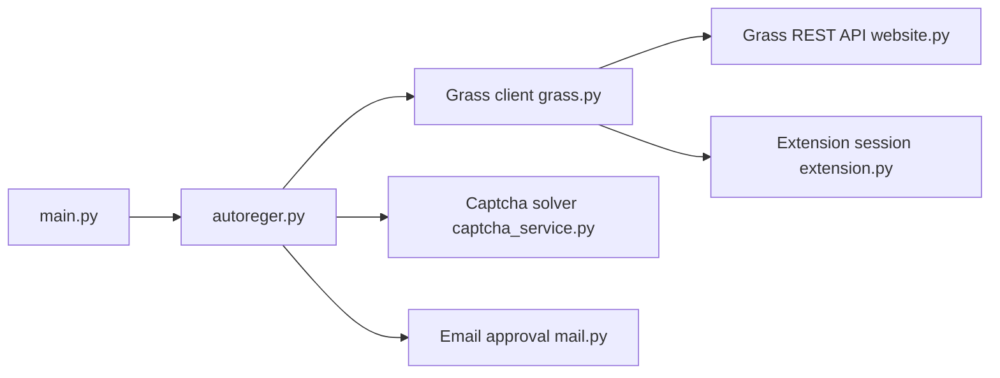

# MsLolita/grass

> Bot Python qui crée des comptes Grass en masse et y cumule des points via proxys, pour farmeurs de récompenses.

## Le problème
Cumuler des points sur le service Grass avec de nombreux comptes demande d'automatiser inscription, validation et connexion.

## Ce que ça fait vraiment
Crée des comptes (avec résolution de captcha par service payant), les valide par email via IMAP, associe un portefeuille Solana, puis ouvre des sessions WebSocket type extension pour cumuler des points. Vérifie les points. Répartit les comptes sur des proxys stockés en base, plusieurs connexions par compte possibles. Réglages par indicateurs dans `data/config.py` ; interface de bureau en option.

## Comment c'est branché


## Essayer
```bash
pip install -r requirements.txt
python main.py
# ou : docker-compose up -d
```

## Coût et pièges
Service de captcha (AntiCaptcha ou 2Captcha), proxys et emails à fournir. Clés privées Solana et mots de passe email stockés en fichiers texte : risque de fuite.

## Ce que ce n'est pas
Pas un outil de données ni d'IA : c'est de l'automatisation d'un service tiers dont les conditions d'usage peuvent interdire les comptes multiples et les bots.

## Alternatives
Le README cite Grass Final Checker et Grass Claimer, de l'auteur (compléments, non alternatives).

## Pour toi
À ignorer : sans intérêt pour un profil data/IA, et il manipule des identifiants et clés de portefeuille dans des fichiers en clair avec un contournement de captcha.
