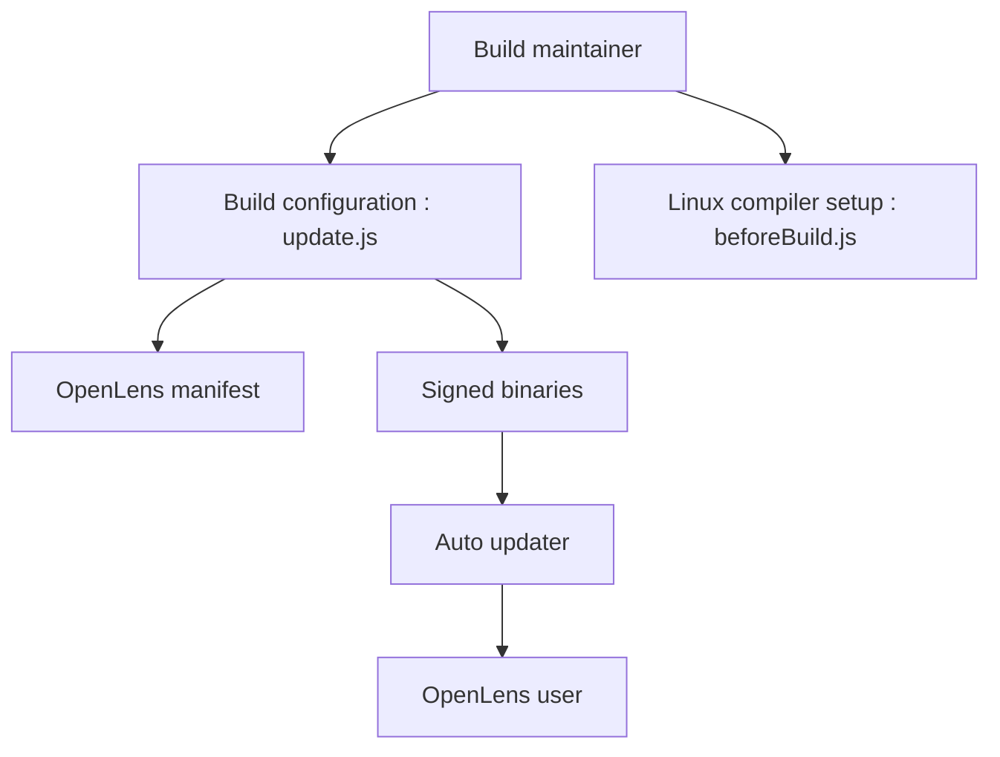

# MuhammedKalkan/OpenLens

> Dépôt de binaires signés du code ouvert de Lens, l'IDE Kubernetes, sans connexion obligatoire.

## Le problème
Lens a fermé son code source ; la partie ouverte n'est plus distribuée en binaires.

## Ce que ça fait vraiment
Ne modifie pas le code source : il fournit des builds signés d'OpenLens. D'après le code, de petits scripts éditent le manifeste amont (`update.js`) et choisissent des compilateurs Linux (`beforeBuild.js`). Un auto-updater est annoncé. Installation via Homebrew, Scoop, Winget, Chocolatey ou binaires.

## Comment c'est branché


## Essayer
```bash
brew install --cask openlens
scoop bucket add extras
scoop install openlens
winget install openlens
```

## Coût et pièges
Gratuit. Le README avertit que Lens a fermé son code : plus de mises à jour à attendre. Dernier push en mai 2024. Aucune licence déclarée sur ce dépôt de build. Binaires tiers : confiance dans le mainteneur.

## Ce que ce n'est pas
Pas le code de Lens : les problèmes logiciels se signalent au dépôt Lens. Pas une version maintenue activement.

## Alternatives
- Lens IDE : la distribution officielle de Mirantis, sous EULA classique.

## Pour toi
À ignorer : figé depuis 2024, binaires d'un tiers sans licence déclarée ; mieux vaut un client Kubernetes suivi.

