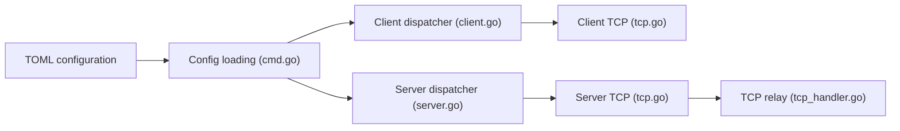

# Musixal/Backhaul

> Tunnel inverse en Go qui traverse NAT et pare-feu, pour exposer un serveur derrière une restriction réseau.

## Le problème
Un service placé derrière un NAT ou un pare-feu n'est pas joignable depuis l'extérieur.

## Ce que ça fait vraiment
Un client derrière le NAT ouvre la connexion vers un serveur, qui expose des ports redirigés. Transports TCP, WebSocket et WSS, multiplexage SMUX, UDP encapsulé dans TCP, TLS, jeton d'authentification, interface web de suivi, rechargement à chaud de la configuration. Configuration par fichier TOML.

## Comment c'est branché


## Essayer
```bash
tar -xzf backhaul_linux_amd64.tar.gz
./backhaul -c config.toml
git clone https://github.com/musixal/backhaul.git && cd backhaul && go build
```

## Coût et pièges
Gratuit ; un serveur public est nécessaire d'un côté. Certificat TLS à générer soi-même pour wss. AGPL-3.0. Dernier push le 2025-09-04.

## Ce que ce n'est pas
Pas un VPN ni un outil de sécurité clé en main : le jeton n'est pas chiffré sur les transports non TLS. Le README contient une adresse de don.

## Alternatives
Aucune alternative nommée dans le README.

## Pour toi
À ignorer : outil réseau sans lien avec la data ou le MLOps, et sans activité depuis plus d'un an.

