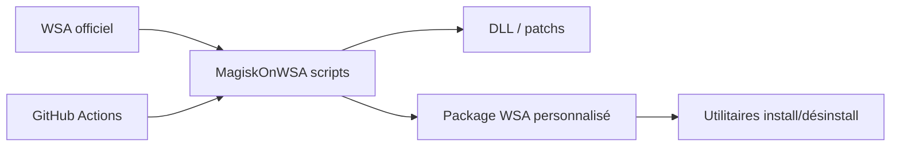

# MustardChef/WSABuilds

> Builds du sous-système Android de Windows avec Magisk, KernelSU et Google Play, pour utilisateurs de Windows 10/11.

## Le problème
Microsoft a mis fin à WSA le 5 mars 2025, alors que des utilisateurs veulent toujours exécuter des applications Android sous Windows avec root et services Google.

## Ce que ça fait vraiment
Le dépôt reconditionne le WSA officiel : des scripts (Python, PowerShell, Bash) et des workflows GitHub Actions le patchent, y injectent Magisk, KernelSU et éventuellement GApps, puis produisent des archives et installateurs. Il est en mode LTS : le README annonce la mise à jour des versions embarquées. Il signale des plantages des builds avec GApps sous Windows 11 depuis juin 2025 et des applications bloquées après le 1er septembre 2026 sans mise à jour LTS.

## Comment c'est branché

## Essayer
Le README ne documente pas de commande, seulement des liens de téléchargement (Windows 10/11 x64, versions LTS).

## Coût et pièges
Gratuit, mais 8 Go de RAM minimum (16 recommandés), virtualisation activée, 10 Go libres sur NTFS. Produit non supporté par Microsoft ; bugs connus avec certains GPU.

## Ce que ce n'est pas
Ce n'est pas un projet officiel Microsoft, ni une solution durable : la plateforme sous-jacente n'est plus soutenue.

## Alternatives
Le README cite MagiskOnWSA, WSAPatch et MagiskOnWSALocal comme briques intégrées.

## Pour toi
À ignorer : outil de bidouille Android sous Windows, sans lien avec ton domaine, sur une plateforme abandonnée.

