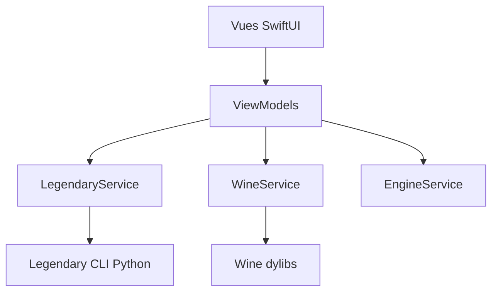

# MythicApp/Mythic

> Lanceur de jeux open source pour macOS qui fait tourner des jeux Windows et gère Epic Games.

## Le problème
Sur Mac, jouer à des titres Windows et gérer sa bibliothèque Epic passe par plusieurs outils bricolés.

## Ce que ça fait vraiment
Application SwiftUI qui pilote la CLI Legendary (Python embarqué) pour l'authentification et les téléchargements Epic, Wine et un moteur DirectX (DX9 à 12, 64 bits) pour lancer les jeux, avec imports manuels, gestion des jeux et présence Discord. Steam n'est pas géré (roadmap).

## Comment c'est branché

## Essayer
Aucune commande documentée : téléchargement de l'application depuis la page du projet.

## Coût et pièges
macOS 14 (Sonoma) minimum. Dépendance à Firebase (liste du README) et à Sparkle pour les mises à jour ; l'usage réel de Firebase n'est pas expliqué.

## Ce que ce n'est pas
Pas un client Steam. Le pied de page dit « All rights reserved » alors que le catalogue indique GPL-3.0 : contradiction non expliquée.

## Alternatives
Aucune alternative nommée dans le README.

## Pour toi
Ignorer : outil de jeu pour Mac sans rapport avec la data ou l'IA, et licence à clarifier.

