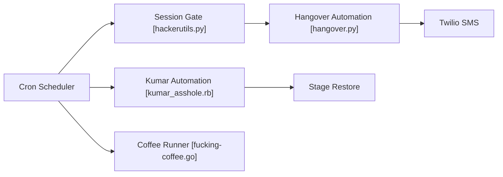

# NARKOZ/hacker-scripts

> Scripts d'automatisation humoristiques inspirés d'une anecdote : SMS d'excuse, mails d'absence, rollback de base et café.

## Le problème
Aucun problème réel ; le dépôt illustre l'automatisation de tâches ennuyeuses par cron, à partir d'une histoire de développeur.

## Ce que ça fait vraiment
Quatre scripts lancés par cron : un SMS de retard via Twilio si une session SSH est active le soir, un mail d'absence à 8h45 sans session ouverte, un script qui lit une boîte Gmail et restaure la base de staging d'un client sur mots-clés, un script qui commande une machine à café par telnet. Implémentations en Ruby, Python, Go et Node.js, en variantes alternatives.

## Comment c'est branché


## Essayer
```bash
gem install dotenv twilio-ruby gmail
45 8 * * 1-5 /path/to/scripts/hangover.sh >> /path/to/hangover.log 2>&1
```
Les autres lignes cron sont dans le README.

## Coût et pièges
Compte Twilio (jetons à ta charge) et identifiants Gmail en variables d'environnement, mot de passe en clair. Le script de restauration écrase une base sur simple mot-clé dans un mail. Le README annonce la WTFPL, mais le catalogue ne détecte aucune licence : c'est le catalogue qui fait foi.

## Ce que ce n'est pas
Ce n'est pas un projet maintenu (dernier push en 2023), ni un modèle à copier en entreprise : les messages envoyés trompent des tiers.

## Alternatives
Aucune alternative nommée dans le README.

## Pour toi
À ignorer : divertissement sans licence claire, sans maintenance, et avec des pratiques (mots de passe en clair, messages trompeurs) à ne pas reproduire.

