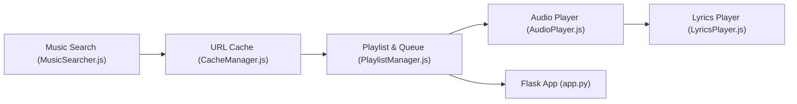

# NB-Group/NB_Music

> Lecteur de musique Electron qui puise l'audio sur Bilibili, avec paroles synchronisées, documenté en chinois.

## Le problème
Écouter de la musique de plusieurs plates-formes sans abonnement VIP.

## Ce que ça fait vraiment
Application Electron : recherche via les API Bilibili et NetEase, import des favoris Bilibili en liste de lecture, lecture avec paroles (NetEase ou sous-titres Bilibili), cache d'URL, listes locales. Un service Flask optionnel gère connexion, listes et correspondances. Développée par deux collégiens.

## Comment c'est branché


## Essayer
```bash
yarn install
yarn debug
yarn run run
yarn build
```

## Coût et pièges
Gratuit, mais dépend des API de Bilibili et de NetEase (le dépôt NetEase cité est « mort »). La qualité Hi-Res demande un compte Bilibili avec grande adhésion. Licence GPL-3.0 avec interdiction commerciale ajoutée dans le texte du README, en tension avec la GPL.

## Ce que ce n'est pas
Pas une source de musique licenciée : le contenu vient de Bilibili. Restrictions commerciales annoncées contradictoires avec la GPL.

## Alternatives
Aucune alternative nommée dans le README.

## Pour toi
À ignorer : lecteur de musique grand public sans rapport avec ton métier, et statut juridique flou.

