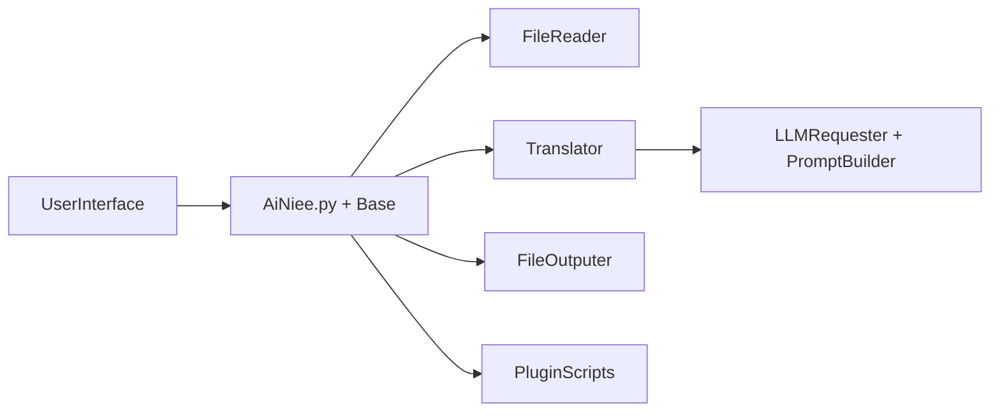

# NEKOparapa/AiNiee

> Outil de traduction par IA pour jeux, livres, sous-titres et documents longs, à interface graphique.

## Le problème
Traduire de longs textes (jeux, romans, sous-titres) avec un LLM perd la cohérence des noms et du style.

## Ce que ça fait vraiment
On configure une API (ou un modèle local via Ollama, LM Studio, Sakura), on dépose un dossier, puis on lance. Lecteurs/écrivains de nombreux formats (Mtool, Translator++, Renpy, Epub, Srt, Word, PDF…), glossaire IA, tableau de non-traduction, remplacement de texte, polling multi-clés, plugins. La description traite aussi du contexte et de la chaîne de pensée.

## Comment c'est branché

## Essayer
Aucune commande documentée : le README décrit trois étapes graphiques (configurer l'interface, glisser un dossier, cliquer sur démarrer) et renvoie aux téléchargements.

## Coût et pièges
Les API en ligne sont payantes à l'usage (le README évoque DeepSeek). Licence AGPL-3.0. Communication surtout en chinois.

## Ce que ce n'est pas
Pas un traducteur hors ligne garanti ; la qualité dépend du modèle. Usage limité à des fins légales et non lucratives selon le README.

## Alternatives
- AiNiee-Next : version en ligne de commande pour serveur.
- ainiee-translate-skill : système de traduction de romans orienté agent.

## Pour toi
À surveiller : bon exemple de pipeline LLM en lot avec glossaire, utile si tu traites de longs textes ; barrière de langue.

