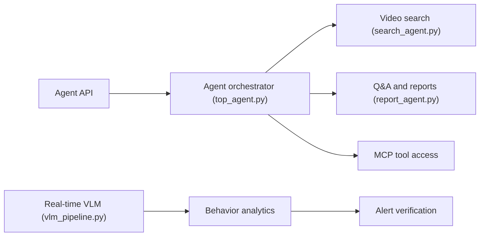

# NVIDIA-AI-Blueprints/video-search-and-summarization

> Blueprint NVIDIA d'agents vidéo GPU : recherche, résumé, Q&A et alertes sur flux ou archives.

## Le problème
Exploiter de gros volumes de vidéo (stockée ou en direct) avec des VLM/LLM demande une pile complète d'ingestion, d'analytique et d'agents.

## Ce que ça fait vraiment
Trois couches : intelligence vidéo temps réel (embeddings, VLM, résultats publiés sur un broker), analytique aval (trajectoires, incidents, alertes vérifiées par VLM) et agents hors ligne (recherche, Q&A, rapports, résumé de longues vidéos, via MCP). Monorepo : agent Python, UI Next.js, analytics, charts Helm/Compose, skills.

## Comment c'est branché

## Essayer
Le README fourni est tronqué avant les commandes de déploiement. Il pointe seulement vers le notebook `deploy/docker/scripts/deploy_vss_launchable.ipynb` (Brev) et un déploiement Docker Compose ; aucune commande n'est présente.

## Coût et pièges
Licence NVIDIA AI Enterprise pour héberger les NIM, ou clés du catalogue NVIDIA/NGC. Prérequis stricts : drivers 595.x, Docker Engine entre 28.3.3 et 29.5.0, NVIDIA Container Toolkit. Exemple Brev : 2 x RTX PRO 6000 SE.

## Ce que ce n'est pas
Pas une bibliothèque légère : c'est une architecture de référence lourde. Les images `develop-*` et `nightly-*` sont « AS IS » ; la recherche vidéo est marquée alpha.

## Alternatives
Aucune alternative nommée dans le README.

## Pour toi
À surveiller : pertinent seulement avec des GPU NVIDIA et un vrai cas vidéo ; sinon la complexité et la licence à vérifier freinent.
