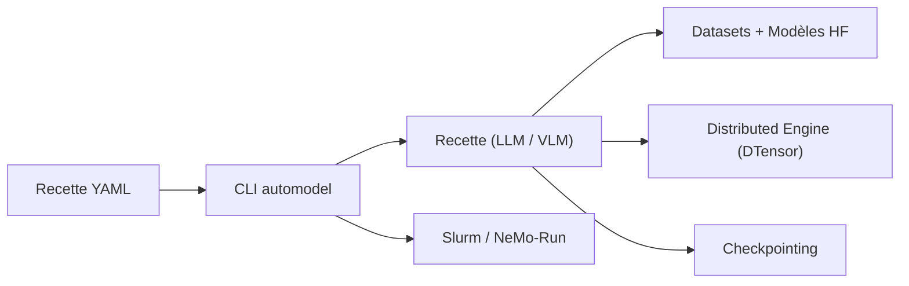

# NVIDIA-NeMo/Automodel

> Bibliothèque PyTorch DTensor pour entraîner et affiner LLM, VLM, diffusion et retrieval à grande échelle.

## Le problème
Passer d'un fine-tuning sur un GPU à un entraînement multi-nœuds oblige à réécrire modèles et stratégie de parallélisme.

## Ce que ça fait vraiment
CLI `automodel` (alias `am`) qui lance des recettes YAML surchargeables en ligne de commande : pré-entraînement, SFT, PEFT (LoRA, QLoRA), distillation, VLM, diffusion, retrieval. Modèles Hugging Face sans conversion, parallélisme FSDP2, tenseur, séquence, MoE via config, lancement Slurm, NeMo-Run ou SkyPilot. Benchmarks du README : 250 TFLOPs/GPU sur DeepSeek V3 671B avec 256 GPU.

## Comment c'est branché


## Essayer
```bash
uv venv
uv sync --frozen
automodel examples/llm_finetune/llama3_2/llama3_2_1b_squad.yaml
automodel examples/llm_finetune/llama3_2/llama3_2_1b_squad.yaml --nproc-per-node 8
```

## Coût et pièges
GPU NVIDIA indispensable, extras CUDA (Transformer Engine, Mamba) selon les recettes. Les gros benchmarks demandent des clusters. 419 issues ouvertes.

## Ce que ce n'est pas
Pas un outil d'inférence ni de serving. Optimisé pour le matériel NVIDIA.

## Alternatives
Le README cite Megatron Bridge (conversions de formats) et NeMo RL (post-entraînement DPO/GRPO), en complément plutôt qu'en remplacement.

## Pour toi
À surveiller : pertinent si tu affines des modèles sur cluster NVIDIA avec des recettes reproductibles ; excessif pour un GPU unique.
