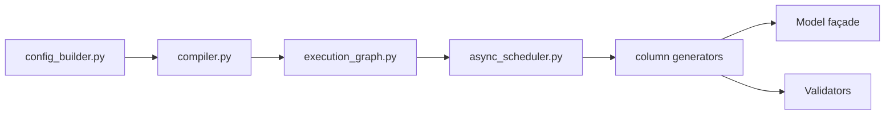

# NVIDIA-NeMo/DataDesigner

> Bibliothèque Python pour générer des jeux de données synthétiques validés, à partir de LLM, d'échantillonneurs ou de seeds.

## Le problème
Demander des données à un LLM produit des lignes sans distributions, sans corrélations ni contrôle qualité.

## Ce que ça fait vraiment
On déclare des colonnes (échantillonneurs, colonnes LLM, images, expressions, embeddings) avec dépendances ; un compilateur construit un graphe d'exécution et un ordonnanceur asynchrone les génère avec contrôle de concurrence. Des validateurs Python, SQL et distants, ou un LLM juge, filtrent. Outils MCP, plugins, prévisualisation, reprise, publication Hugging Face et export OpenTelemetry sont prévus.

## Comment c'est branché


## Essayer
```bash
pip install data-designer
export NVIDIA_API_KEY="your-api-key-here"
data-designer config providers
data-designer config models
data-designer config list
```

## Coût et pièges
Clé d'API NVIDIA Build, OpenAI ou OpenRouter à ta charge. NVIDIA Build est réservé à l'évaluation. Télémétrie (noms de modèles, comptes de tokens), désactivable par `NEMO_TELEMETRY_ENABLED=false`.

## Ce que ce n'est pas
Pas un outil d'anonymisation de données réelles. La qualité dépend du modèle et des validateurs choisis.

## Alternatives
- Aucune alternative nommée dans le README.

## Pour toi
Adopter pour des jeux de test ou d'entraînement synthétiques : approche déclarative et validée, avec télémétrie à désactiver.
